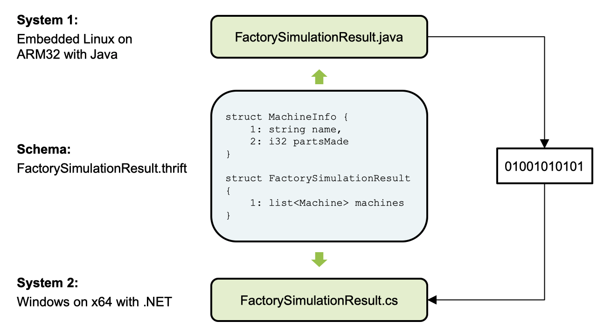
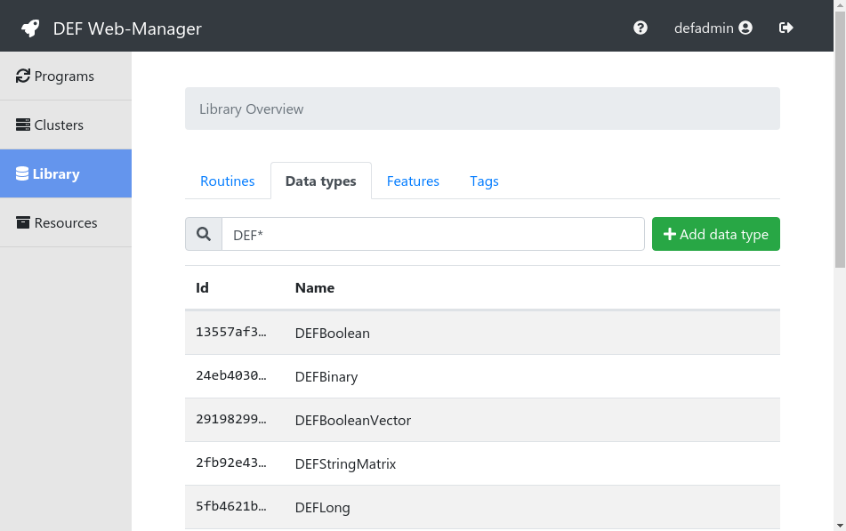

.. _data-types-detail:

=========
DataTypes
=========

For programming a routine for the DEF the concepts behind the used data types have to be understood first.

As already mentioned in the :ref:`Motivation <def-motivations>` the DEF gives the opportunity to communicate across different programming languages.
This leads to some problems regarding the exchange of data between them.
Different programming languages have different data types which might not be compatible with data types from other languages.
Furthermore the hardware used in a distributed system might also be heterogeneous which makes it also difficult to exchange data directly between systems.

To cope with that the DEF uses Thrift as a framework for data exchange and remote procedure calls.
Thrift is an interface definition language and a binary communication protocol which works with numerous different programming languages.
For more information about Thrift visit the `Homepage <https://thrift.apache.org/>`_ or `Thrift: The Missing Guide <https://diwakergupta.github.io/thrift-missing-guide/>`_.

The idea behind Thrift is that you define a data type for data exchange in an intermediate language.
The Thrift compiler can create classes or structs from this data type definition for different programming languages which can be directly imported into an existing project and used.
If a data type *X* is used in Java and sent via Thrift to a C# service for example, it is on the Java side serialized into bytes according to the used Thrift protocol and sent over the network.
On C# side the bytes will be deserialized according to the used Thrift protocol and a object from the C# data type *X* is created.
This process is illustrated in the image below.

The DEF offers a number of basic data types which are already defined and can be used. An example for a basic DEF data type is the DEFInteger type which is listed in the Thrift definition language below. The DEFInteger is just a wrapper class for a 32-bit integer value.

.. code-block:: thrift

    namespace java at.enfilo.def.datatype
    namespace py def_api
    typedef string Id

    struct DEFInteger {
        1: optional Id _id = "6389a2fb-eace-310b-b178-9c4d7b1daaa0",
        2: i32 value
    }

All the data types the DEF offers are listed in the :ref:`web-manager` in the *Library* section like shown in the image below.

