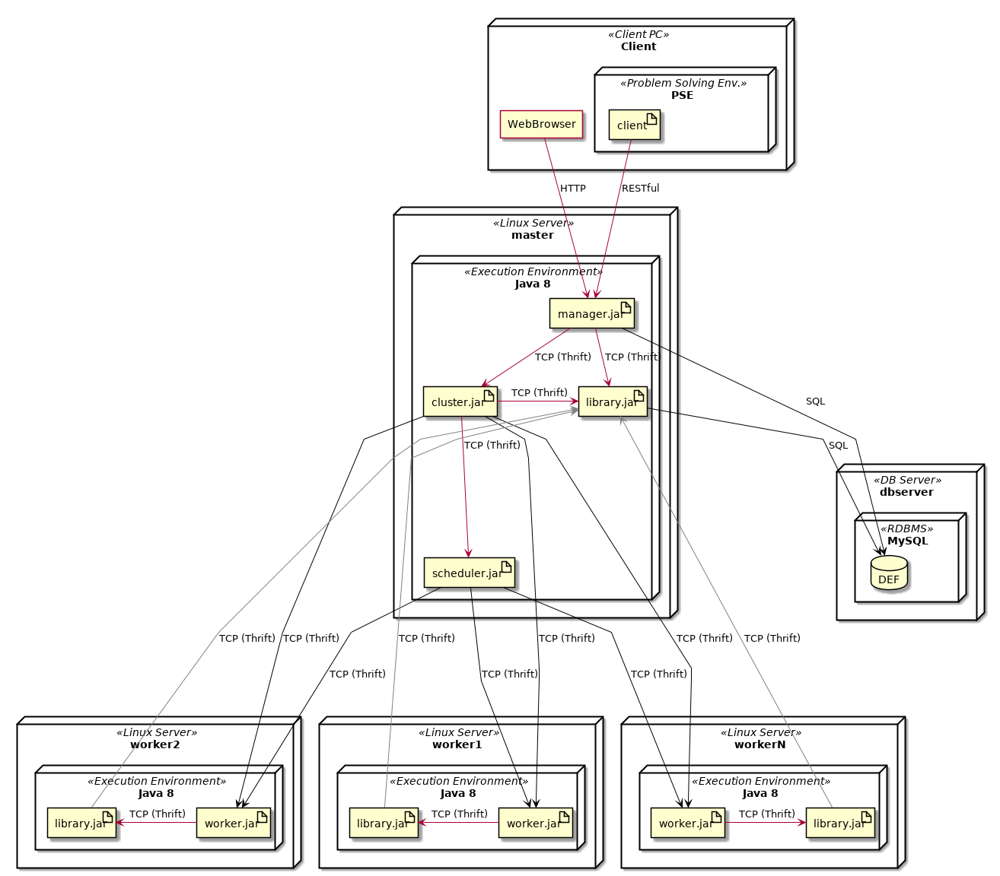
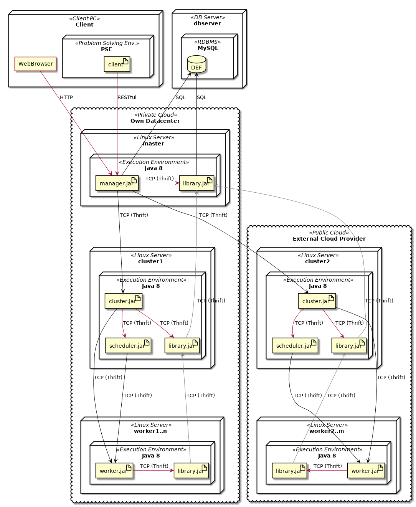
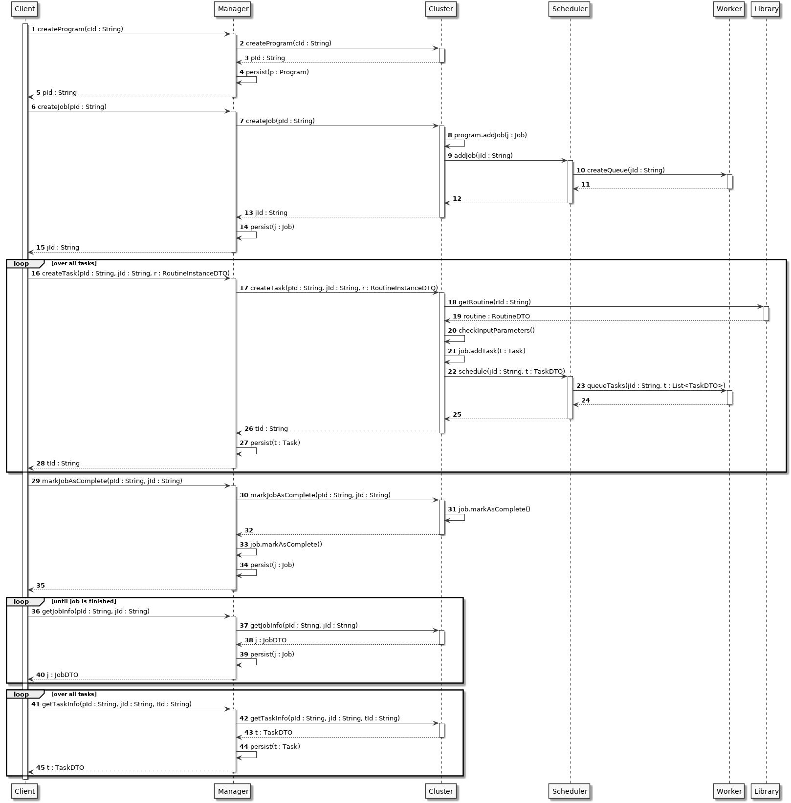

====================
Runtime & Deployment
====================

Deployable components
========================

* Manager - Package *manager*
* Cluster - Package *cluster*
* Scheduler - Package *scheduler*
* Library - Package *library*
* Worker - Package *worker-node*
* Reducer - Package *reducer-node*

(See :ref:`packages`)

Deployment process
====================

#. Install and start a SSH server with password authentication on host *hostname*
#. Navigate to package of a deployable component
#. ``$ ../gradlew deploy -Phost=<hostname>``

(On host *hostname* a user called ``def`` with same password must be existing)

**Deployment process by hand:**

#. Navigate to package of a deployable component
#. Create a "fat jar" with gradle: ``$ ../gradlew shadowJar``
#. Copy "fat jar" (``build/libs/<component-version-all.jar>``) to destination host
#. Copy all resource files (``build/resources/main/*``) to destination host
#. On destination host start component: ``$ java  -Dlog4j.configurationFile=log4j2.xml -jar *<component-version-all.jar>``

Minimal deployment
---------------------

DEF can be deployed on a single computer (e.g. localhost) with following components:

* Cluster
* Scheduler
* Library
* Worker

Before deploying components with ``$ ../gradlew deploy -Phost=localhost`` a local user ``def`` with password ``def`` should be created.
To run a master library (recommend) a local MariaDB server with a database named ``def`` with db-user ``def`` (password ``def``) should be installed and configured:

#. ``# mysql`` (as root)
#. ``> use mysql``
#. ``> delete from user where host = '';``
#. ``> create database def;``
#. ``> create user 'def'@'%' identified by 'def';``
#. ``> grant all privileges on def.* to 'def'@'%';``
#. ``> flush privileges;``

Simple deployment
-------------------

Complex deployment
-------------------

Execution Logic - Client view
===============================

Runtime Environment FHV
=========================

TODO: OpenStack Env.

Ports
=======

Internal Service Ports
------------------------

Service ports follow this schema:

.. code-block::

    400xy
       ||
       |`- RESTful / Thrift HTTP / Thrift TCP
       `-- Service

Default ports:

=========================== ========= ============= ===========
Service                     RESTful   Thrift HTTP   Thrift TCP
=========================== ========= ============= ===========
ManagerService              40000     40001         40002
ClusterService              40010     40011         40012
SchedulerService            40020     40021         40022
WorkerService               40030     40031         40032
LibraryService              40040     40041         40042
CloudCommunicationService   40050     40051         40052
ManagerWebService           40060     40061         40062
ReducerService              40070     40071         40072
ClientRoutineService        40080     40081         40082
=========================== ========= ============= ===========

Logging
---------

======================== ============
Host/Port                Value
======================== ============
Graylogging Port (UDP):  12201
Graylogging Host         10.0.50.56
======================== ============