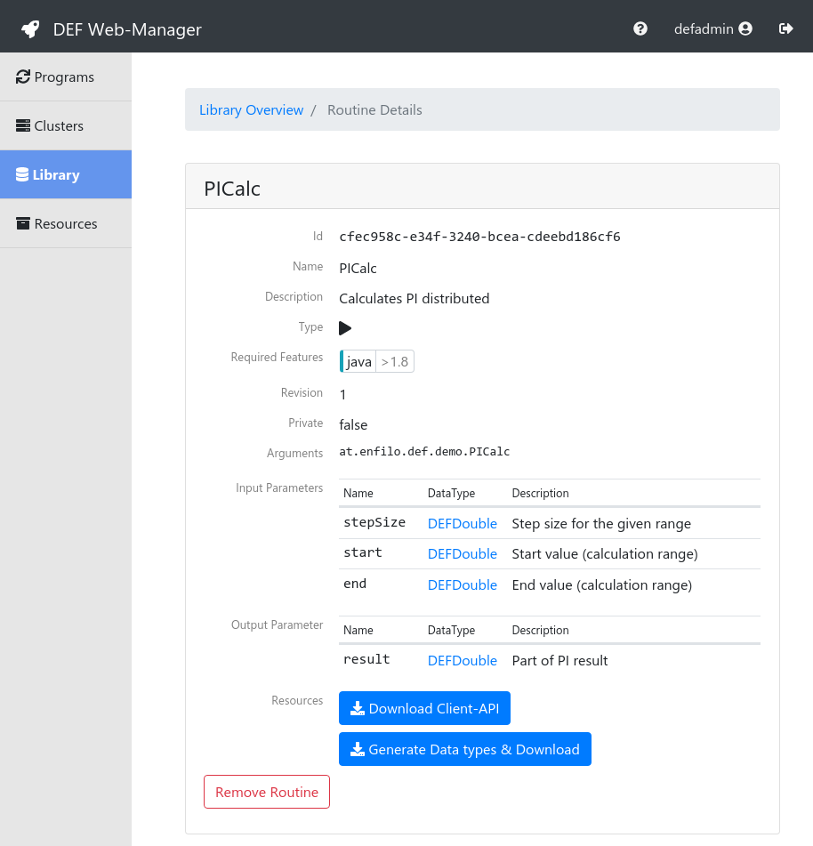
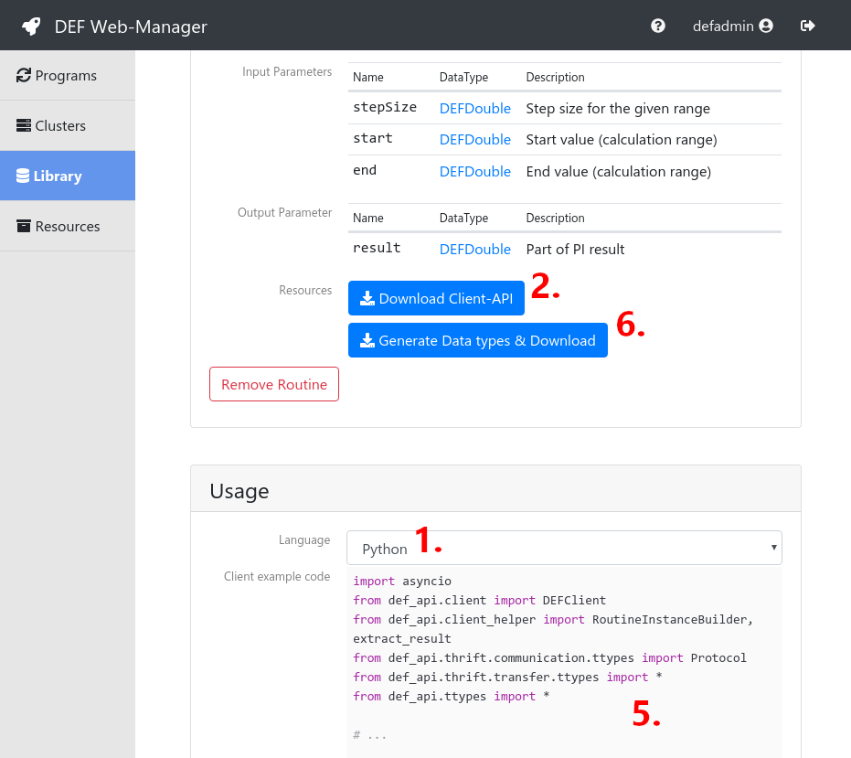

.. _getting-started:

===============
Getting Started
===============

Get in touch with the DEF and run a Demo :ref:`routine`. This section assumes that a running DEF instance is available.

The following example shows how to calculate :math:`\pi` parallel and distributed in the DEF.
The :math:`\pi` calculation itself is already implemented in Java and part of the demo Routines.
A :ref:`client` will be developed in Python within this tutorial which trigger the Java implementation in parallel.

.. _pi-example:

:math:`\pi` Example
===================

There are a many different ways to calculate :math:`\pi`, one is to use the following formula:

.. math::

   \pi = \int_0^1 \frac{4}{1+x^2}\mathrm{d}x

Transformed to a discrete sum, which can be easy calculated with a for loop, it looks like:

.. math::

    \pi \approx \frac{1}{N} \sum_{i=1}^N \frac{4}{1+{x_i}^2} , \;\; x_i = \frac{(i - 0.5)}{N}

Converted into C/Java-code it looks like

.. code-block:: c
    :linenos:

    for (i = 1; i <= N; i++) {
        x_i = (i - 0.5) / N;
        pi += 4.0 / (1.0 + x_i*x_i);
    }
    pi /= N;

whereby as higher :code:`N` as exacter the :math:`\pi` calculation.

This calculation can be done in parallel, if the :code:`for` loop will split up in to multiple parts.
E.g., the :code:`for`-loop will count from :code:`1` to :code:`1000` and there are 4 processor cores available,
then it is possible to setup 4 separate :code:`for`-loops counting from :code:`1..250`, :code:`251..500`, :code:`501..750`, :code:`751..1000` and run it parallel.
At the end the 4 :code:`pi` variables must be sum up to get the final and merged result.

.. image:: img/for-loop-split.svg
    :align: center

PICalc Routine
==============

The DEF provides a demo :ref:`routine` called *PICalc* with exact the implementation described above.
This Routine can be found by navigating in the :ref:`web-manager` to *Library* and select *PICalc*.

The 3 input parameters, *stepSize*, *start* and *end* refers to the example above, whereby *start* and *end* defines the range of the :code:`for`-loop.

Create a Python client
======================

The *Usage* part is placed below the detail view of the *PICalc* :ref:`routine`.
Please follow the steps to create a proper Python client for the *PICalc* Routine:

#. Switch the Language to *Python*
#. Press *Download Client-API*
#. Unzip the downloaded file and install the Python Client-API:

.. code-block:: bash

    cd python
    pip3 install . --user --upgrade

4. Create a new Python project with a Python IDE
#. Copy the example code to a new file called :code:`client.py` in the previous created project
#. Press *Generate Data types & Download*
#. Unzip the downloaded file and move the included :code:`ttypes.py` to the project

After this steps the :code:`client.py` should be modified for the environment:

.. code-block:: python
    :linenos:
    :lineno-start: 13

    # Create client
    client = DEFClient(host='<replace with manager address>', port=40002, protocol=Protocol.THRIFT_TCP)

    # Create program
    future_p_id = client.create_program('<replace with clusterId>', '<replace with userId>')
    loop.run_until_complete(future_p_id)
    p_id = future_p_id.result()

Replace :code:`<replace with manager address>` with either the hostname or IP address of the :ref:`manager` instance.
Replace :code:`<replace with clusterId>` with the Id of the :ref:`cluster`. This Id can be fetched by navigate to *Clusters* in :ref:`web-manager` selecting the right one and fetch the Id from the *Cluster details* page.
Replace :code:`<replace with userId>` with any name.

Program, Job, Tasks
===================

To calculate :math:`\pi` distributed and parallel with the DEF, the example should be transformed in the proper form with :ref:`Programs <program>`, :ref:`Jobs <job>` and :ref:`Tasks <task>`.
The idea is to split up :code:`for`-loop into multiple parts and run it in parallel, and sum the partial results up (as already mentioned in the :ref:`Example above <pi-example>`).

One Task will be one part of the :code:`for`-loop (see :ref:`Example <pi-example>`) and a :ref:`reduce-routine` (*DoubleSumReducer*) will sum all Task results.

Let's define the concrete parameters/values for the calculation:

=============== ======================
STEPS           :math:`10^{10}`
stepSize        :math:`\frac{1}{10^{10}}`
Number of Jobs  :math:`1`
Number of Tasks :math:`100`
=============== ======================

The complete modified :code:`client.py`, the changes are highlighted.

.. literalinclude:: ./client.py
    :language: python
    :emphasize-lines: 20-25, 27-29, 34-35, 37-50, 55-60
    :linenos:

- Lines 20-25: Defines the parameters from the table above
- Lines 27-29: Restrict the number of Jobs
- Lines 34-35: Add/Attach the *DoubleSumReducer* to the Job
- Lines 37-50: Create all 100 Tasks with the partial :code:`for`-loops
- Lines 55-60: Fetch the reduced (final) result

Execute
=======

Run the :code:`client.py` and wait for the result. While waiting, the progress can be watched in the :ref:`web-manager` by navigating to the *Programs* tab.
Additionally the *Clusters* tab and the *Cluster details page* shows the distribution of the :ref:`Tasks <task>` to the available :ref:`Workers <worker>`.

Summary
=======

This example demonstrate how to trigger a parallel :math:`\pi` calculation in Python by using a Java :ref:`routine` for the calculation.

The focus lies on the :ref:`client` development, the usage of :ref:`web-manager` and the transformation of the problem to a proper DEF structure.
