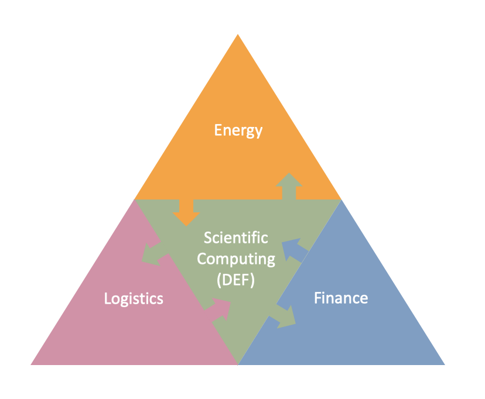

.. _jrz:

======================================================
Josef Ressel Centre for Applied Scientific Computing
======================================================

The `Josef Ressel Centre for Applied Scientific Computing (JRZ) <https://www.fhv.at/forschung/energie/josef-ressel-zentrum-fuer-angewandtes-wissenschaftliches-rechnen/>`_ is a research centre of the `FHV <https://www.fhv.at/>`_ and is operating in the fields of energy, logistics and finance.

The idea behind the JRZ is that analysts, who are working in the mentioned domains, are developing algorithms for their specific use. From these algorithms at least parts could be reused in the other domains. Furthermore it has to be considered that the developed algorithms may be very computationally intensive.

The DEF was developed as a part of the JRZ for enabling the execution of algorithms independent of programming languages and runtime environments. The algorithms are executed distributed in parallel, which may to a significant time saving dependent on the computed problem.

The main benefits that arise from using the DEF are:

* high performance through parallelisation of code execution
* high efficiency because all available resources are utilized
* high flexibility for the application programmers, because the library routines can be integrated into their applications independen of the programming languages used
* high scalability because of the usage of Cloud Computing

