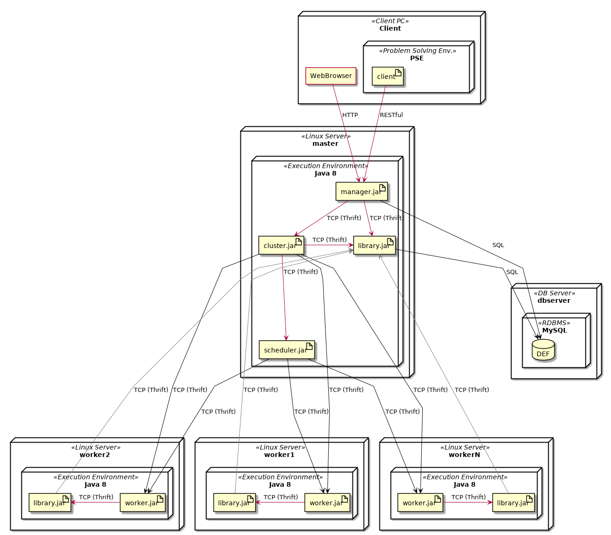
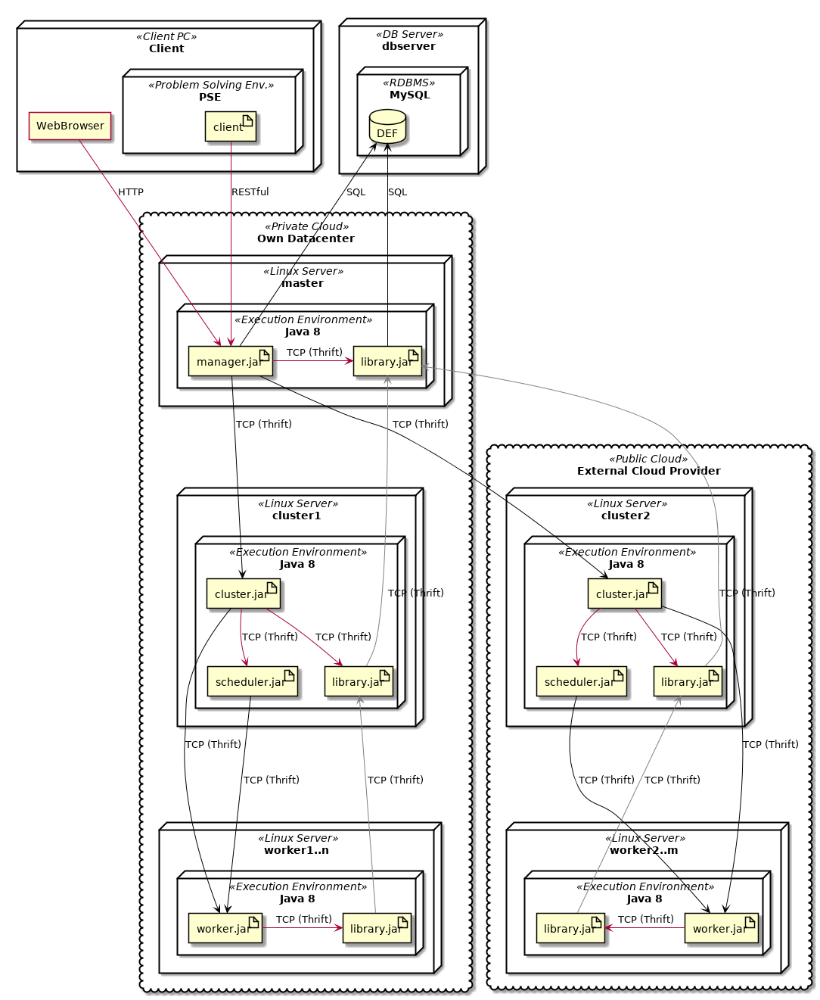
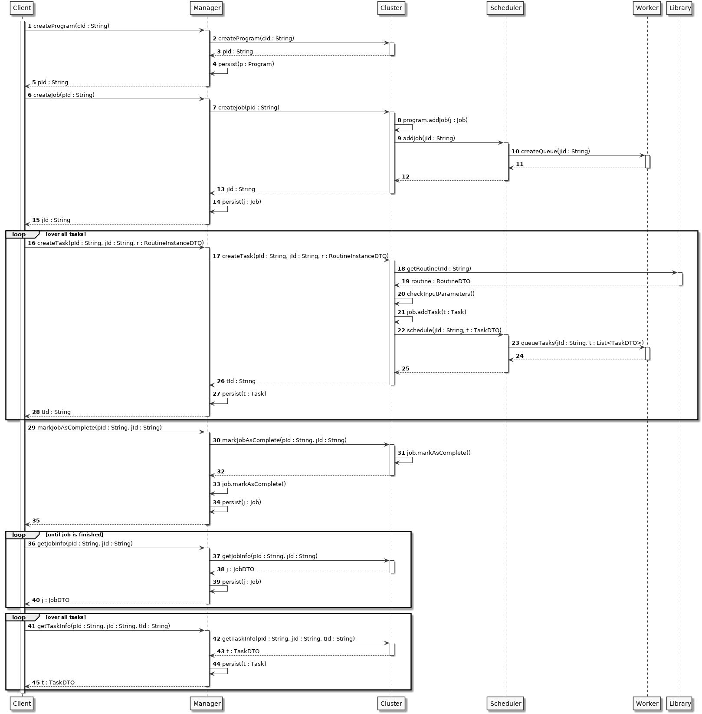

=========================
Installation & Deployment
=========================

Deployable components
========================

* Manager - Package *manager*
* Cluster - Package *cluster*
* Scheduler - Package *scheduler*
* Library - Package *library*
* Worker - Package *worker-node*
* Reducer - Package *reducer-node*

(See :ref:`architecture_components`)

.. _deployment_process:

Deployment process
====================
For deploying the DEF components the following steps need to be done:

#. Install and start a SSH server with password authentication on host *hostname* (On host *hostname* a user called ``def`` with same password must be existing)
#. For each deployable component:

    #. Navigate to package of the component
    #. Deployment:

        #. With gradle:

            #. ``$ ../gradlew deploy -Phost=<hostname>``
        #. By hand:

            #. Create a "fat jar" with gradle: ``$ ../gradlew shadowJar``
            #. Copy "fat jar" (``build/libs/<component-version-all.jar>``) to destination host
            #. Copy all resource files (``build/resources/main/*``) to destination host
            #. On destination host start component: ``$ java  -Dlog4j.configurationFile=log4j2.xml -jar *<component-version-all.jar>``

The individual components need to be deployed in a certain order to ensure that the necessary connections between them can be established:

#. Manager with its Library
#. Cluster with its Library and Scheduler
#. Nodes (Workers and Reducers) with their Libraries

The hostname of the Cluster is defined in the YAML files of each Node. If ``cluster-registration`` is set to ``true`` then the Nodes register themselves automatically with the Cluster.
To check if the registration was successful the log file of the Node can be used.

.. code-block::

    cluster-registration: true
    cluster-endpoint:
        host: 10.0.50.55
        port: 40012
        protocol: THRIFT_TCP

It is still necessary to register the Cluster with the Manager by hand. This can be done with the :ref:`shell`. Start the DEF shell and switch to the Manager service:

.. code-block::

    service switch --service MANAGER --host <manager-hostname> --port 40002 --protocol THRIFT_TCP

Then add the Cluster to the Manager:

.. code-block::

    manager cluster add-direct --host <cluster-hostname> --port 40012 --protocol THRIFT_TCP

The deployment of many workers can be sped up by saving the IP addresses of each worker into the hosts file of your computer with the naming convention ``worker-<n>``, where n stands for an ongoing number from 1 to the number of workers in the environment.
If this is given, the following command can be used to deploy all workers (f.e. ten workers in this case) at once:
``for I in 1 2 3 4 5 6 7 8 9 10; do ../gradlew restart -Phost=worker-$I; done``

Minimal deployment
---------------------

DEF can be deployed on a single computer (e.g. localhost) with following components:

* Cluster
* Scheduler
* Library
* Worker

Before deploying components with ``$ ../gradlew deploy -Phost=localhost`` a local user ``def`` with password ``def`` should be created.
To run a master library (recommend) a local MariaDB server with a database named ``def`` with db-user ``def`` (password ``def``) should be installed and configured:

#. ``# mysql`` (as root)
#. ``> use mysql``
#. ``> delete from user where host = '';``
#. ``> create database def;``
#. ``> create user 'def'@'%' identified by 'def';``
#. ``> grant all privileges on def.* to 'def'@'%';``
#. ``> flush privileges;``

Simple deployment
-------------------

A simple deployment on distributed machines (both virtual or physical machines are possible) can be seen in the picture below. Here the Manager and Cluster components are packed together on one machine
and each worker has its own machine.

Complex deployment
-------------------

In a complex DEF deployment the Manager, Cluster and Worker/Reducer components are all deployed on their own machines. Additionally it is possible to set up further Clusters with their Nodes in external (public) cloud environments.
However, the Manager needs to stay withing your private environment.

Execution Logic - Client view
===============================

