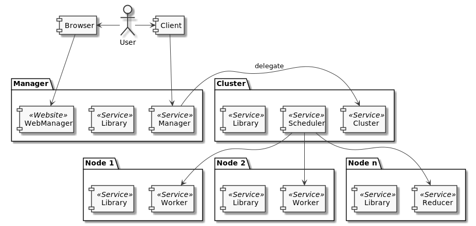

.. _components:

==========
Components
==========

As the name states the DEF is a distributed framework and execution environment with many different components. The image below shows all the components of the DEF in a simplified manner.

.. _client:

Client
======

Client is an individual piece of software which uses the DEF Client API to create :ref:`Programs <program>`, :ref:`Jobs <job>` and :ref:`Tasks <task>`. The client is usually responsible for fetching the results (Task or Job results) and interpret it.
A client interacts only with the :ref:`manager` component.

.. _manager:

Manager
=======

The entry point for all :ref:`client` calls is the Manager component. The Manager consists of the Manager service itself, a :ref:`library` instance with all stored :ref:`Routines <routine>` and a :ref:`web-manager` service.

The Manager manages an arbitrary number of different :ref:`cluster` components and :ref:`Programs <program>`. A :ref:`program` and therefore all its :ref:`Jobs <job>` and :ref:`Tasks <task>` are assigned to one Cluster and will be executed in the Cluster's environment.
Furthermore the Manager knows which Program is located on which Cluster and manages the delegation of the Client calls to the specific Cluster.

.. _library:

Library
=======

If a component needs a :ref:`routine` or an associated :ref:`executable` it will be fetched from the nearest located Library.
The Library services itself are hierarchical organized: If an instance can not provide the requested Routine it will fetch it from next higher instance and cache it.
The top most Library instance is located at :ref:`manager` and provides all registered Routines and Executables.

.. _web-manager:

Web-Manager
===========

As a monitoring and administration-tool the Web-Manager can be used to:

  - monitor finished and running :ref:`Programs <program>`, :ref:`Jobs <job>` and :ref:`Tasks <task>`
  - display the components that are associated with one :ref:`manager`
  - find and create :ref:`Routines <routine>`
  - find and create :ref:`DataTypes <datatype>`

.. _cluster:

Cluster
=======
Each Cluster consists of a Cluster service, a :ref:`library` instance and a :ref:`scheduler` service.

A Cluster manages all computing resources (:ref:`Nodes <node>`) which are associated with it and handles the scheduling and load-balancing of computational :ref:`Tasks <task>`.
It holds also all :ref:`Programs <program>`, :ref:`Jobs <job>` and Tasks which are executed within it.

.. _node:

Node
====

A Node is an abstract term for a computing resource and can either be a :ref:`worker` or a :ref:`reducer`. Both consists of the special service and a :ref:`library` instance.

.. _worker:

Worker
------

On a Worker the :ref:`Tasks <task>` and their associated :ref:`routine` are actually executed.
By executing a Routine the associated :ref:`Executables <executable>` will be fetched from the :ref:`library`, and all parameter values (:ref:`resource`) will be passed to the Executables.

Each Worker can have different runtime environments, respectively problem solving environments.
The Cluster knows which environments are installed on which workers and can therefore dispatch the incoming Tasks accordingly.

.. _reducer:

Reducer
-------

A Reducer is very similar to a :ref:`worker`, but instead of executing :ref:`ObjectiveRoutines <objective-routine>` associated to :ref:`Tasks <task>` :ref:`ReduceRoutines <reduce-routine>` will be executed.
ReduceRoutines are attached to :ref:`Jobs <job>` and reduces all Task results to one single Job result.

