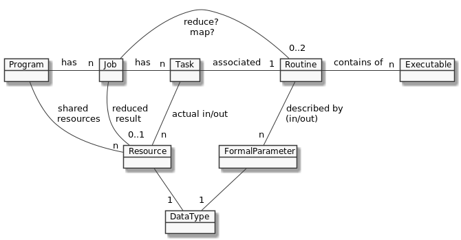

.. _def-domain:

========================
Domain & Terminology
========================

The problems that can be computed on the DEF have to be embarrassingly parallel and be put in a specific structure. This structure is shown in the image below.

.. _program:

Program
========

A Program is the top-most container and the entry point for each computation. It encapsulates all relevant information.

Additional a Program can hold an arbitrary number of :ref:`Resources <resource>`, the SharedResources.
A SharedResource is a readonly Resource which is spread over all computing resources within a :ref:`cluster` while the Program is active.
For example input parameters (see :ref:`task`) which are every time the same are typical candidates for SharedResources.

.. _job:

Job
====

Each :ref:`program` has many Jobs. A Job is a synchronisation point which means all Jobs are executed sequentially.
A Job groups :ref:`Tasks <task>` which can be run in parallel and have no dependency between each other.

Additionally a :ref:`reduce-routine` and/or a :ref:`map-routine` can be assigned to the Job.
The ReduceRoutine acts as a final reduce step if all Tasks are finished and the Job will also have a reduced result after the ReduceRoutine is finished.

.. _task:

Task
=====

Each :ref:`job` has many Tasks. A Task represents a subroutine of the mentioned :ref:`Motivation <def-motivations>` with all the necessary information (actual parameters) for executing it. It is the part of the :ref:`program` that will be computed in parallel.

.. _routine:

Routine
========

One :ref:`task` is associated with exactly one Routine.
A Routine defines all the meta information for exactly one subroutine (see :ref:`Motivation <def-motivations>`).
A Routine can have one or more :ref:`Executables <executable>` which are the binaries that are actually executed in the DEF.

There are different types of Routines: *Objective*, *Reduce*, *Client*, *Map* and *Store*.
If there is no addition to the term *Routine*, then Routine refers to *ObjectiveRoutine*.

:ref:`More about Routines <routines-detail>`

.. _formal-parameter:

FormalParameter
===============

Each :ref:`routine` has a set of FormalParameters which defines the input and output parameters.
A FormalParameter consists of a name and a :ref:`data-type`.

.. _resource:

Resource
=========

A :ref:`task` has many Resources which represent the actual input and output values.
A Resource includes the :ref:`data-type` and the (serialized) data itself.

.. _data-type:

DataType
========

The :ref:`Resources <resource>` which define the actually passed input and output parameters are bound to have the same DataType as the formal parameters which act as a template for the input and output parameters.

:ref:`More about DataTypes <data-types-detail>`

.. _executable:

Executable
==========

Executables are the :ref:`routine` implementation itself in a binary or executable format. E.g., executable JAR if the :ref:`routine` is written in Java or a zipped Python files.
