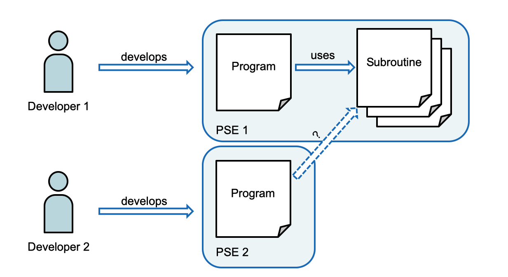
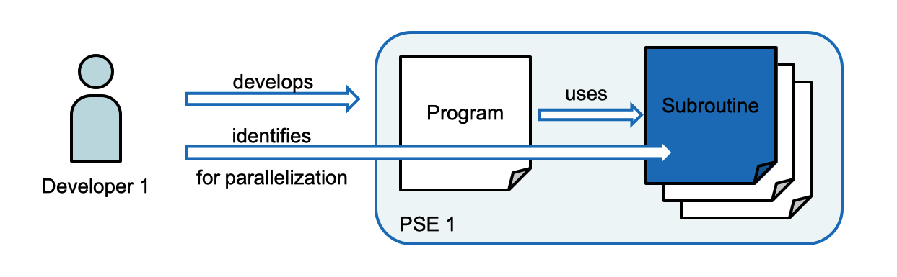

.. _def-motivations:

==================================
Motivations for Developing the DEF
==================================

There have been two main motivations for developing and using the DEF, namely the reusability of algorithms independent of programming languages and runtime environments and the parallel and distributed execution of computational problems.

Reusability
===========

The following image is used to demonstrate the motivation of reusing algorithms. We suppose that developer 1 develops a program in his preferred problem solving environment (PSE), for example Python, and uses some self developed subroutines for that. Developer 2 is also developing a program in her preferred PSE, for example in Java, and notices that she could use a subroutine developed by developer 1.

To prevent her from re-developing the same routine for another PSE the DEF gives her the possibility to call developer 1's subroutine although it is written for another PSE. The DEF handles the communication between the different PSEs and gives the opportunity to upload subroutines into its library so they are accessible for all developers using the DEF.

Parallelisation
===============

The image below is used to demonstrate the motivation of using parallelisation when computing problems. We suppose that developer 1 is once again developing a program in his preferred problem solving environment (PSE), for example MATLAB. He identifies subroutines he is using suitable for parallelisation. If he eventually wants to compute them in parallel he has to determine if his PSE is supporting parallelisation. The second point to identify is if the used hardware has actually enough power for parallel computations.

By using the DEF the developers don't have to think about how to parallelise their computations as the DEF provides an infrastructure for handling that. The user only has to specify which parts should be computed in parallel.

