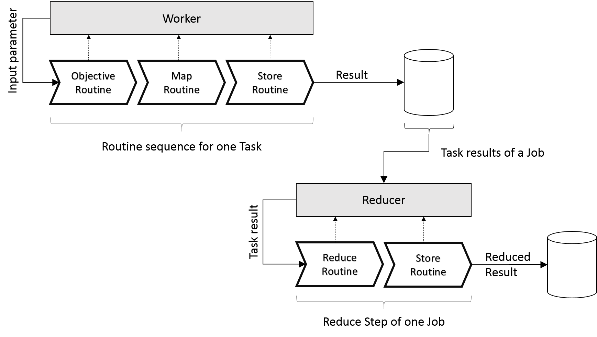

.. _routines-detail:

========
Routines
========

The Routines represents the *heart* of the DEF and are the part which will be executed.

As shortly described in the :ref:`Domain <routine>`, a Routine will consists of meta-information, like name, description, parameters, etc. and the implementation itself.
The implementation - logic of the Routine - can be written in any language which is supported by the DEF by using the provided Routine-API.

Routine sequence & communication
================================

As mentioned before an :ref:`objective-routine` is directly associated to a Task.
The Task, which holds all actual parameters (values), will pass the requested input parameters to the ObjectiveRoutine via the :ref:`worker` instance.
After the ObjectiveRoutine is finished with the computations the result will be passed to the :ref:`map-routine`.
If there is no special MapRoutine defined at the :ref:`job` the default MapRoutine will be used.
The mapped results (key-value pairs) will be forwarded to the :ref:`store-routine` which saves the results to a storage or forwards them in memory to the Worker instance.

If a :ref:`reduce-routine` is assigned to the Job, the results of the Tasks (key-value pairs) will be forwarded to the ReduceRoutine for a final reduce step.

More information: :ref:`task-sequence`.

Routine Types
=============

.. _objective-routine:

ObjectiveRoutine
----------------

An ObjectiveRoutine is associated to a :ref:`task` and is that kind of a Routine which do the *expensive* operations. The Task will pass the given input parameters (:ref:`resource`) to the ObjectiveRoutine, which processes the values and comes up with a result (output parameter) at the end.

.. _map-routine:

MapRoutine
----------

A MapRoutine is responsible for mapping the result from an :ref:`objective-routine` to a key-value map.
The ObjectiveRoutine provides a single result with a defined :ref:`data-type`. This value will be transformed to one or more key-value pairs, whereby the key is a string and the value can be an arbitrary DataType.

If there is no MapRoutine specified, a default MapRoutine will be run after each ObjectiveRoutine and the result will be mapped to a single key-value pair with the key "DEFAULT" and the value is the untouched result.

.. _reduce-routine:

ReduceRoutine
-------------

A ReduceRoutine will reduce multiple :ref:`task` results to one single result from the same :ref:`data-type`.
Because of :ref:`map-routine` and the resulting key-value pairs, the ReduceRoutine will reduce all values from the same key to one single result.

.. _store-routine:

StoreRoutine
------------

A StoreRoutine is a DEF-internal routine and defines the storage of :ref:`Resources <resource>`.

.. _client-routine:

Client Routine
===============

A Client Routine enables the users to transfer most of their client code into the DEF where it will be executed rather
than on the client side. So a ClientRoutine is actually :ref:`client` code running directly in the :ref:`cluster`.
On the client side it is only necessary to create a program, build and transfer the Client Routine to the DEF and to
fetch the results afterwards.

Using a Client Routine makes sense if many tasks and jobs are computed but the user is only interested in a few results.
Without a Client Routine many data is transferred between the DEF and the client during the execution of a program. If a
Client Routine is used the data stays within the DEF and only the data that is relevant for the user is transferred back
to the client.

TODO