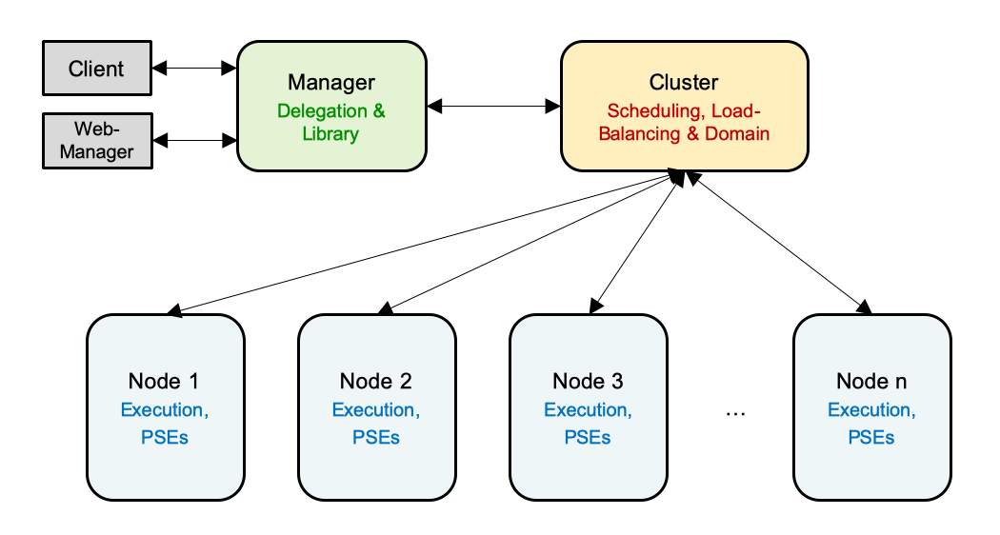
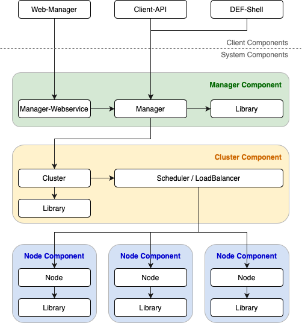
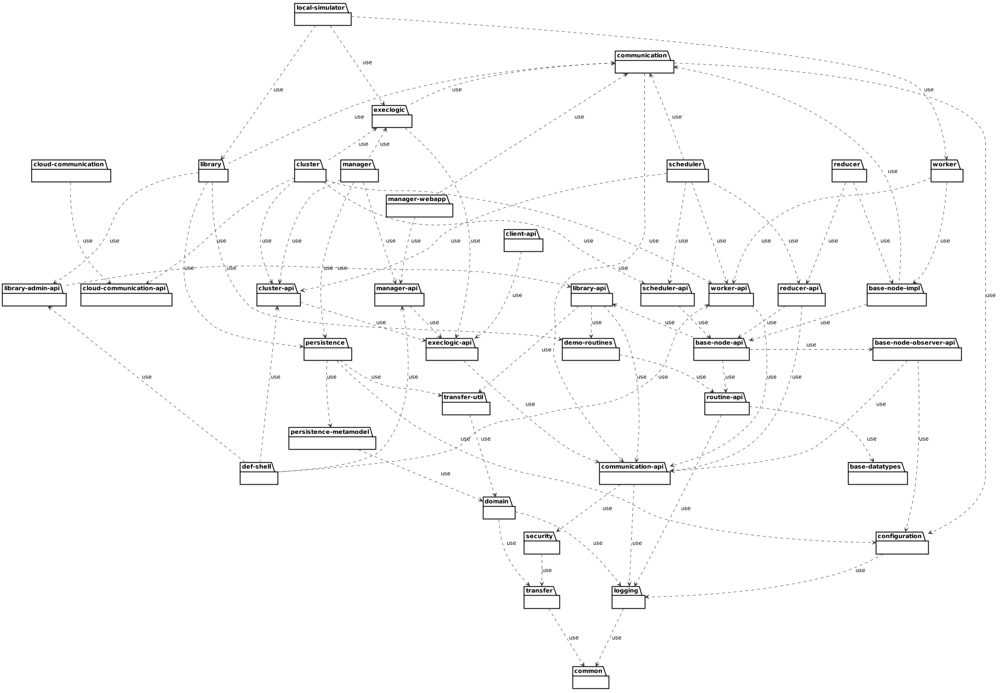
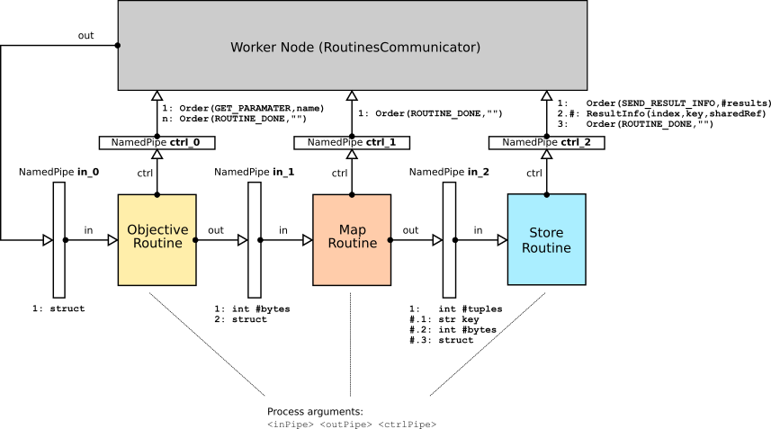

.. _architecture:

==========================
Architecture & Components
==========================

General
========

Prototype 2 is a multi-project software with many sub-projects, which are organized with the build tool `Gradle <www.gradle.org>`_.

High-level Architecture
========================

Manager
-------

The *Manager* is the entry point for all client calls and is responsible for holding delegating the calls to the appropriate
*Cluster*. Furthermore, it holds the library with all routines.

Cluster
-------

The *Cluster* manages a number of *Nodes* and distributes all incoming calls among them. It holds all *Programs* with
their associated *Jobs* and *Tasks*.

Node
-----

The *Nodes* are the parts of the DEF that do the actual work. The different types of *Nodes* that are available are
*Workers* and *Reducers*.

Worker
^^^^^^^

The *Workers* hold the different execution environments for the supported programming languages. On the *Workers* the *Tasks*
with their routines are actually executed.

Reducer
^^^^^^^^

The *Reducers* are responsible for reducing all *Task* results that belong to one *Job* to a single result.
*Reducers* are optional parts of the DEF setup and are as well optional to use in each *Job*.

.. Client-Routine Worker
.. ^^^^^^^^^^^^^^^^^^^^^^
..
.. The *Client-Routine Workers* allow the execution of code that is typically executed on the client side. For futher information
.. see :ref:`client-routine`.

Components
===========

Client Components
------------------

Client-API
^^^^^^^^^^^

For each programming language supported a Client-API is provided which can be used for making calls to the DEF.
For further information on how to create a DEF client see :ref:`client-dev`.

Web-Manager
^^^^^^^^^^^^

The *Web-Manager* is a web application that can be used for monitoring ongoing *Programs*, *Jobs* and *Tasks*,
for finding an uploading *Routines* and *DataTypes* and for monitoring the infrastructure that belongs to a *Manager*.

System Components
------------------

Manager Components
^^^^^^^^^^^^^^^^^^^^

Manager
''''''''

The Manager component is the entry point for all calls from the Client-APIs and the Manager-Webservice component.
It is responsible for delegating the calls to the appropriate Cluster and giving information about its related Clusters.

Manager-Webservice
'''''''''''''''''''

The Manager-Webservice is the entry point for all calls from the *Web-Manager*. It delegates the calls to the Manager and
processes the incoming and outgoing data so the *Web-Manager* can work with them.

Library
''''''''

The Library that lies with the *Manager* is the master library that holds all the *Routines* and *Datatypes* that were created.
The other libraries are fetching the data they use and don't have from the master library.

Cluster Components
^^^^^^^^^^^^^^^^^^^^

Cluster
''''''''

The Cluster component is responsible for managing a number of different *Node* components that are associated with it.
It delegates all incoming calls from the Manager component to the Scheduler which then distributes all of them among the Node
components. The Cluster component holds all the *Programs*, *Jobs* and *Tasks* as well as the execution logic an how they
are processed.

Scheduler
'''''''''''

The Scheduler component gets all the *Tasks* and *ReduceJobs* and distributes them to its corresponding Node components.

LoadBalancer
''''''''''''''

An optional component which monitors all Nodes of a Cluster and balances the work (*Tasks*) between them.

Library
''''''''

The library that lies with the *Cluster* is a slave library that is responsible for caching routines that are used by
its *Nodes*. If it doesn't hold the data that is needed from its *Nodes* it fetches them from the master library and passes
them to back to the *Nodes*.

Node Components
^^^^^^^^^^^^^^^^

Worker
'''''''

The Worker components execute all the *Tasks* they get from the Scheduler, so they are running the *ObjectiveRoutines*
and pass back the results to the Cluster afterwards.

Reducer
''''''''

The Reducer components are very similar to the Worker components, but instead of *ObjectiveRoutines* *ReduceRoutines*
are executed.

.. Client-Routine Worker
.. '''''''''''''''''''''''
..
.. The Client-Routine Worker components can execute *ClientRoutines*.

Library
''''''''

The Library that lies with the Node components is a slave library the Node components use to fetch the *Routines* they
have to execute. If a *Routine* isn't available in the library, then the data is fetched from the *Cluster's* library.

Packages (Sub-Projects)
==========================

Overview and a short description of all packages (sub-project or modules):

base-datatypes
----------------

Default datatypes provided by DEF. This package include Schema definitions and Java implementations of these datatypes.

base-node-api
--------------

Service interfaces and client for *base-node-impl*.

base-node-impl
---------------

Base service implementation of worker / reducer. (package name should be changed to *base-node*)

base-node-observer-api
--------------------------

Observer interface for *base-node-impl*. *base-node-impl* (worker or reducer) notifies observer with events (task received, task finished, etc.)

client-api
-----------

**DEF Java Client**.

cloud-communication
----------------------

Cloud communication service (implementation of *cloud-communication-api*). This service provides base cloud functions like create instance, start instance, etc. and pass this to a cloud provider (e.g. Amazon, private OpenStack).

cloud-communication-api
-------------------------

Service interfaces and client for *cloud-communication*.

cluster
--------

**DEF Cluster** implementation (*cluster-api* and *execlogic*).

cluster-api
------------

Service interfaces and client for *cluster*.

common
-------

Central package, which provides some standard interfaces and implementations (like *Tuple* or *TimeoutMap*) for all other packages.

communication
---------------

Provides base service communication capabilities: RESTful, `Thrift <http://thrift.apache.org>`_ over HTTP and TCP. This package also includes *TicketService* implementation and Ticket handling process.

communication-api
------------------

Base interfaces and implementation for communication between DEF components. Every **-api** package, which provides a service interface and client needs this package. This package also includes *TicketService* interface and client.

configuration
--------------

Provides the functionality to read a configuration from a file (yml, xml, etc.).

def-shell
----------

Shell based administration client for DEF.

demo-routines
--------------

Java implementations of a few demo routines.

domain
--------

Domain classes with persistence annotations (JPA).

execlogic
----------

Service implementation of *execlogic-api*. This implementation is abstract and need a concrete one - see *cluster* or *manager*.

execlogic-api
--------------

Execution logic service interface and client. Execution logic means the process to create *Programs*, *Jobs*, *Tasks*, etc.

library
--------

**DEF Library** implementation. The DEF Library manage and stores Routines (interface and implementation).

library-api
------------

Service interface and client for *library*.

local-simulator
----------------

DEF Manager / DEF Cluster and DEF Worker Simulator for local Routine development.

logging
---------

Provides centralised logging (Graylog) via log4j2.

manager
---------

**DEF Module** service implementation (*manager-api* and *execlogic*). Entry point for every DEF Client.

manager-api
-------------

Service interfaces and client for *manager*.

manager-webapp
---------------

Web application for *manager*.

persistence
------------

RDBMs persistence layer for *domain* used by *manager* and *library*. ORM framework: Hibernate 5.

persistence-metamodel
----------------------

Generated meta classes for *persistence*.

reducer
--------

**DEF Reducer** service implementation.

reducer-api
-------------

Service interface and client for *reducer*.

routine-api
------------

Java API for Routines.

scheduler
----------

**DEF TaskScheduler** and **DEF ReduceScheduler** implementation (*scheduler-api*)

scheduler-api
---------------

Service interface and client for *scheduler*.

security
---------

Communication security layer.

transfer
----------

Provides general DTOs (Data Transfer Object) for communication between DEF components. (`Thrift <http://thrift.apache.org/>`_ generated classes.)

transfer-util
--------------

Include utilities like DTO <-> Domain mapper.

worker
-------

**DEF Worker** service implementation (*worker-api*).

worker-api
-----------

Service interface and client for *worker*.

Node Architecture
===================

Abstract implementation of Worker and Reducer.

.. _task-sequence:

Task Sequence
---------------

Every *Task* will be transformed to a *Task-Sequence* before executing. A *Sequence-Step* represent a real OS process. The processes will communicate via *NamedPipe*'s.

.. literalinclude:: src/RoutineCommunication.thrift
    :linenos:
    :language: thrift

A normal *Task* will split up into following *Sequence-Steps*:

*  *ObjectiveRoutine* - directly assigned to *Task*.
*  *MapRoutine* - assigned to *Job*.
*  *StoreRoutine* - assigned to *Cluster* and *Worker*.

ObjectiveRoutine
^^^^^^^^^^^^^^^^^

The *ObjectiveRoutine* will receive a input parameter while sending the command ``Order(GET_PARAMETER, <name>)`` through **ctrl_0**. ``Order`` represent a Apache Thrift object and ``name`` is the requested input parameter name.
After Node (``RoutinesCommunicator``) received the ``Order`` it will send the the requested input parameter data (Apache Thrift ``struct``) through pipe **in_0** to *ObjectiveRoutine*.

If *ObjectiveRoutine* received all needed input parameters and routine process is done, the result (Apache Thrift ``struct``) will be sent through pipe **in_1** with the following format:

#. Size of result in bytes as Apache Thrift ``i32``,
#. Result (Apache Thrift ``struct``) itself.

In addition the ``Order(ROUTINE_DONE, "")`` will be send to Node via **ctrl_0**.

MapRoutine
^^^^^^^^^^^

The _MapRoutine_ receive the result (Apache Thrift ``struct``) from *ObjectRoutine* through pipe **in_1**.

After mapping *ObjectiveRoutine* result to a key-value set, this key-value set will be stored in following format to pipe **in_2**:

1. Count of key-value tuples as Apache Thrift ``i32``,
1. For every key-value tuple
    1. Key as Apache Thrift ``str``,
    1. Size of value in bytes as Apache Thrift ``i32``,
    1. Value (Apache Thrift ``struct``) itself.

In addition the ``Order(ROUTINE_DONE, "")`` will be send to Node via **ctrl_1**.

StoreRoutine
^^^^^^^^^^^^^^^

The *StoreRoutine* receive triples (Key, Size, Values) from *PartitionRoutine* via **in_2** and store the value of this triples.

For every received triple a ``ResultInfo(seq#, key, url, data)`` will be send through **ctrl_2**. Either ``data`` or ``url`` must be set, whereby ``data`` represent the value itself and ``url`` a pointer to the stored value.

At the end a ``Order(ROUTINE_DONE, "")`` will be send to Node via **ctrl_2**.

Thrift documentations

    * `Thrift Tutorial <https://thrift-tutorial.readthedocs.io/en/latest/index.html>`_
    * `Thrift: The Missing Guide <https://diwakergupta.github.io/thrift-missing-guide/>`_
