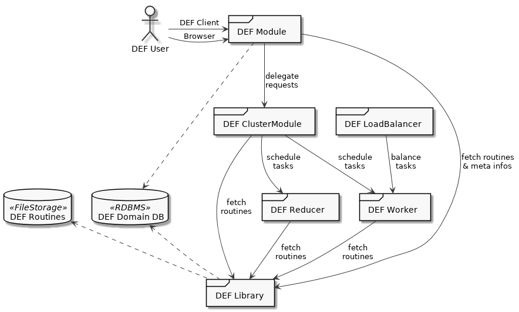
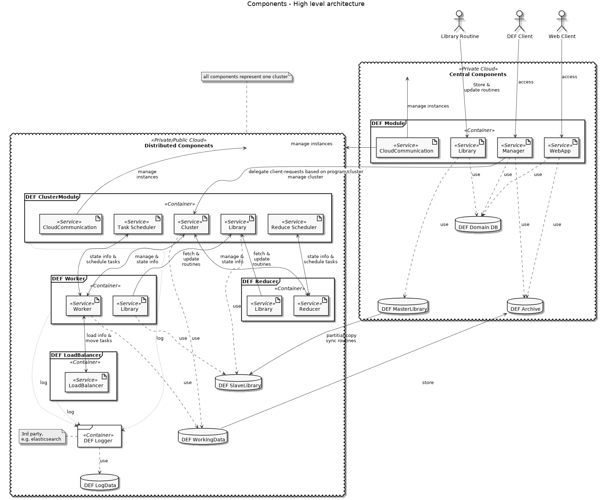
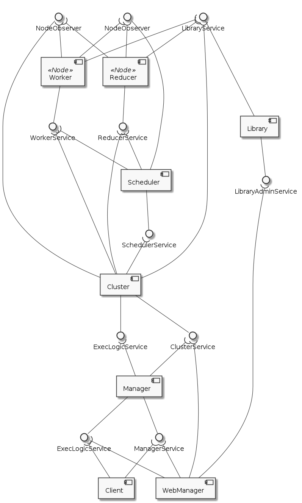
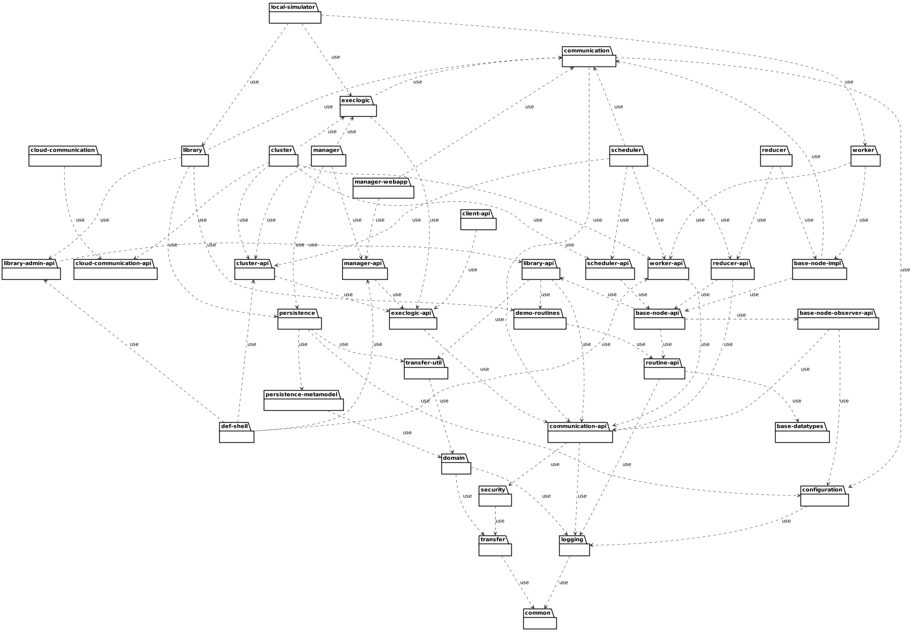
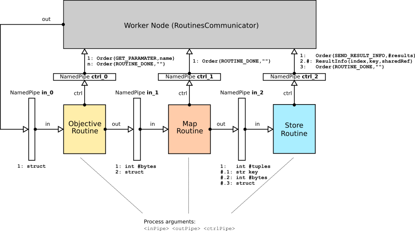

=============================
Software Architecture
=============================

General
========

Prototype 2 is a multi-project software with many sub-projects, which are organized with the build tool `Gradle <www.gradle.org>`_.

High level view
=================

DEF Module
-----------

Central component of DEF. DEF Module consists of **manager**, **library** (master), **cloud-communcation** and **manager-webapp**. DEF Module act as entry point for every client (DEF Client or Browser) and delegate incoming requests to a cluster if necessary. The web interface provides a personal view to DEF: Own *Programs*, *Jobs*, *Tasks* and *Routines*. Additional runtime information about DEF Cluster and DEF Worker are provided.

DEF ClusterModule
------------------

The DEF ClusterModule consists of **cluster**, **scheduler**, **library** (slave) and **cloud-communcation**. DEF ClusterModule manages a number of DEF Workers and Reducers and delegate the "real" worker in form of *Tasks* to them. All of execution logic how a *Program*, *Job* and *Task* were processed is implemented in this DEF ClusterModule.

DEF LoadBalancer
-----------------

An optional module, which monitors all workers of a cluster and balance the work (*Tasks*) between them.

DEF Worker
-----------

DEF Worker create a Routine Sequence from each assigned *Task* and run this sequence (see TODO). Routine implementation will be fetched from local DEF Library instance.

DEF Reducer
------------

DEF Reducer is very similar to DEF Worker, but instead of running *ObjectiveRoutines*, *ReduceRoutines* will be executed.

DEF Library
------------

A library which provides Routine metadata and Routine executables. DEF Library instances are hierarchically organized: Slave libraries fetch missing information from a other slave library or master library.

Components
============

A more detailed view with all (sub)components can be found here:

Service-Interfaces
=====================

The following picture shows all services the DEF offers. For each service the uses internally three different interfaces:

    * a **request interface**: queues all request and returns a ticket id
    * a **response interface**: for fetching the results
    * a **ticket service interface**: for fetching the current state of a ticket

The services are defined through Thrift files:

ExecLogicService
-----------------

Represents the whole execution logic from the user's point of view.

.. literalinclude:: src/ExecLogicService.thrift
    :linenos:
    :language: thrift

ManagerService
---------------

Represents the *Cluster* management.

.. literalinclude:: src/ManagerService.thrift
    :linenos:
    :language: thrift

ClusterService
---------------

Represents the *Node* management of a cluster.

.. literalinclude:: src/ClusterService.thrift
    :linenos:
    :language: thrift

SchedulerService
-----------------

Represents the scheduler functionality for *Tasks* and *ReduceJobs*.

.. literalinclude:: src/SchedulerService.thrift
    :linenos:
    :language: thrift

LibraryService
---------------

Represents the library functionality: search, downloading of *Routines*, *DataTypes*, etc.

.. literalinclude:: src/LibraryService.thrift
    :linenos:
    :language: thrift

LibraryAdminService
--------------------

Extends the library functionality on creating and deleting of *Routines*, *DataTypes*, etc.

.. literalinclude:: src/LibraryAdminService.thrift
    :linenos:
    :language: thrift

WorkerService
--------------

Represents a specialisation of the *Node* and is responsible for executing the assigned *Tasks*.

.. literalinclude:: src/WorkerService.thrift
    :linenos:
    :language: thrift

ReducerService
---------------

Represents a specialisation of the *Node* and is responsible for reducing the *Task* results of a *Job*.

.. literalinclude:: src/ReducerService.thrift
    :linenos:
    :language: thrift

NodeObserverService
--------------------

Observer interface of a *Node*.

.. literalinclude:: src/NodeObserverService.thrift
    :linenos:
    :language: thrift

TicketService
--------------

.. literalinclude:: src/TicketService.thrift
    :linenos:
    :language: thrift

The data types used in the interfaces are defined in the following files.

.. literalinclude:: src/DTOs.thrift
    :linenos:
    :language: thrift

.. literalinclude:: src/CommunicationDTOs.thrift
    :linenos:
    :language: thrift

Thrift documentations

    * `Thrift Tutorial <https://thrift-tutorial.readthedocs.io/en/latest/index.html>`_
    * `Thrift: The Missing Guide <https://diwakergupta.github.io/thrift-missing-guide/>`_

.. _packages:

Packages (Sub-Projects)
==========================

Overview and a short description of all packages (sub-project or modules) of Prototype 2:

base-datatypes
----------------

Default datatypes provided by DEF. This package include Schema definitions and Java implementations of these datatypes.

base-node-api
--------------

Service interfaces and client for *base-node-impl*.

base-node-impl
---------------

Base service implementation of worker / reducer. (package name should be changed to *base-node*)

base-node-observer-api
--------------------------

Observer interface for *base-node-impl*. *base-node-impl* (worker or reducer) notifies observer with events (task received, task finished, etc.)

client-api
-----------

**DEF Java Client**.

cloud-communication
----------------------

Cloud communication service (implementation of *cloud-communication-api*). This service provides base cloud functions like create instance, start instance, etc. and pass this to a cloud provider (e.g. Amazon, private OpenStack).

cloud-communication-api
-------------------------

Service interfaces and client for *cloud-communication*.

cluster
--------

**DEF Cluster** implementation (*cluster-api* and *execlogic*).

cluster-api
------------

Service interfaces and client for *cluster*.

common
-------

Central package, which provides some standard interfaces and implementations (like *Tuple* or *TimeoutMap*) for all other packages.

communication
---------------

Provides base service communication capabilities: RESTful, `Thrift <http://thrift.apache.org>`_ over HTTP and TCP. This package also includes *TicketService* implementation and Ticket handling process.

communication-api
------------------

Base interfaces and implementation for communication between DEF components. Every **-api* package, which provides a service interface and client needs this package. This package also includes *TicketService* interface and client.

configuration
--------------

Provides the functionality to read a configuration from a file (yml, xml, etc.).

def-shell
----------

Shell based administration client for DEF.

demo-routines
--------------

Java implementations of a few demo routines.

domain
--------

Domain classes with persistence annotations (JPA).

execlogic
----------

Service implementation of *execlogic-api*. This implementation is abstract and need a concrete one - see *cluster* or *manager*.

execlogic-api
--------------

Execution logic service interface and client. Execution logic means the process to create *Programs*, *Jobs*, *Tasks*, etc.

library
--------

**DEF Library** implementation. The DEF Library manage and stores Routines (interface and implementation).

library-api
------------

Service interface and client for *library*.

local-simulator
----------------

DEF Manager / DEF Cluster and DEF Worker Simulator for local Routine development.

logging
---------

Provides centralised logging (Graylog) via log4j2.

manager
---------

**DEF Module** service implementation (*manager-api* and *execlogic*). Entry point for every DEF Client.

manager-api
-------------

Service interfaces and client for *manager*.

manager-webapp
---------------

Web application for *manager*.

persistence
------------

RDBMs persistence layer for *domain* used by *manager* and *library*. ORM framework: Hibernate 5.

persistence-metamodel
----------------------

Generated meta classes for *persistence*.

reducer
--------

**DEF Reducer** service implementation.

reducer-api
-------------

Service interface and client for *reducer*.

routine-api
------------

Java API for Routines.

scheduler
----------

**DEF TaskScheduler** and **DEF ReduceScheduler** implementation (*scheduler-api*)

scheduler-api
---------------

Service interface and client for *scheduler*.

security
---------

Communication security layer.

transfer
----------

Provides general DTOs (Data Transfer Object) for communication between DEF components. (`Thrift <http://thrift.apache.org/>`_ generated classes.)

transfer-util
--------------

Include utilities like DTO <-> Domain mapper.

worker
-------

**DEF Worker** service implementation (*worker-api*).

worker-api
-----------

Service interface and client for *worker*.

Node
======

Abstract implementation of Worker and Reducer.

.. _task-sequence:

Task Sequence
---------------

Every *Task* will be transformed to a *Task-Sequence* before executing. A *Sequence-Step* represent a real OS process. The processes will communicate via *NamedPipe*'s.

.. literalinclude:: src/RoutineCommunication.thrift
    :linenos:
    :language: thrift

A normal *Task* will split up into following *Sequence-Steps*:

*  *ObjectiveRoutine* - directly assigned to *Task*.
*  *MapRoutine* - assigned to *Job*.
*  *StoreRoutine* - assigned to *Cluster* and *Worker*.

ObjectiveRoutine
^^^^^^^^^^^^^^^^^

The *ObjectiveRoutine* will receive a input parameter while sending the command ``Order(GET_PARAMETER, <name>)`` through **ctrl_0**. ``Order`` represent a Apache Thrift object and ``name`` is the requested input parameter name.
After Node (``RoutinesCommunicator``) received the ``Order`` it will send the the requested input parameter data (Apache Thrift ``struct``) through pipe **in_0** to *ObjectiveRoutine*.

If *ObjectiveRoutine* received all needed input parameters and routine process is done, the result (Apache Thrift ``struct``) will be sent through pipe **in_1** with the following format:

#. Size of result in bytes as Apache Thrift ``i32``,
#. Result (Apache Thrift ``struct``) itself.

In addition the ``Order(ROUTINE_DONE, "")`` will be send to Node via **ctrl_0**.

MapRoutine
^^^^^^^^^^^

The _MapRoutine_ receive the result (Apache Thrift ``struct``) from *ObjectRoutine* through pipe **in_1**.

After mapping *ObjectiveRoutine* result to a key-value set, this key-value set will be stored in following format to pipe **in_2**:

1. Count of key-value tuples as Apache Thrift ``i32``,
1. For every key-value tuple
    1. Key as Apache Thrift ``str``,
    1. Size of value in bytes as Apache Thrift ``i32``,
    1. Value (Apache Thrift ``struct``) itself.

In addition the ``Order(ROUTINE_DONE, "")`` will be send to Node via **ctrl_1**.

StoreRoutine
^^^^^^^^^^^^^^^

The *StoreRoutine* receive triples (Key, Size, Values) from *PartitionRoutine* via **in_2** and store the value of this triples.

For every received triple a ``ResultInfo(seq#, key, url, data)`` will be send through **ctrl_2**. Either ``data`` or ``url`` must be set, whereby ``data`` represent the value itself and ``url`` a pointer to the stored value.

At the end a ``Order(ROUTINE_DONE, "")`` will be send to Node via **ctrl_2**.

Thrift documentations

    * `Thrift Tutorial <https://thrift-tutorial.readthedocs.io/en/latest/index.html>`_
    * `Thrift: The Missing Guide <https://diwakergupta.github.io/thrift-missing-guide/>`_