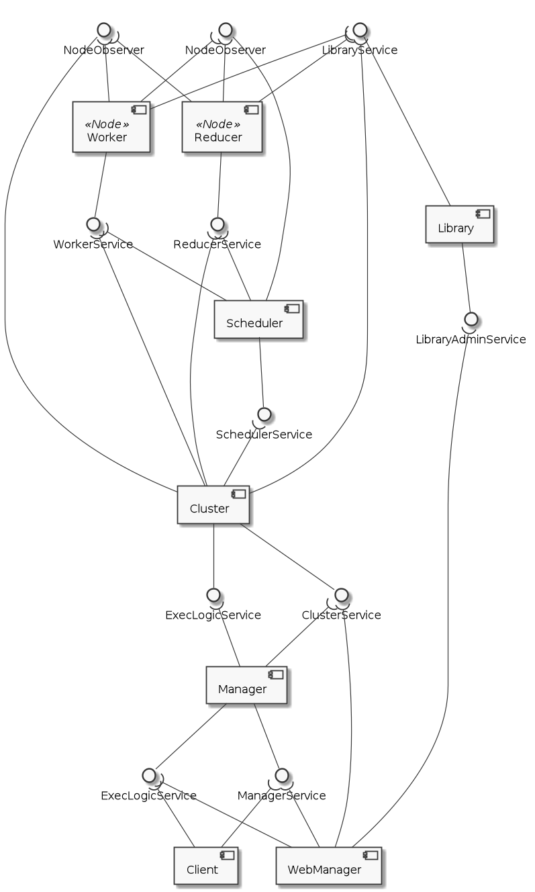

.. _services:

=======================
Services & Interfaces
=======================

Overview & General
=====================

The following picture shows all services the DEF offers. For each service the uses internally three different interfaces:

    * a **request interface**: queues all request and returns a ticket id
    * a **response interface**: for fetching the results
    * a **ticket service interface**: for fetching the current state of a ticket

Services
=========

The services are defined through Thrift files.

.. toctree::
    :maxdepth: 2

    services/execlogicservice
    services/managerservice
    services/clusterservice
    services/schedulerservice
    services/libraryservice
    services/libraryadminservice
    services/workerservice
    services/reducerservice
    services/nodeobserverservice
    services/ticketservice

Data types
==========

The data types used in the interfaces are defined in the following files.

.. toctree::
    :maxdepth: 2

    datatypes/dtos
    datatypes/communicationdtos
