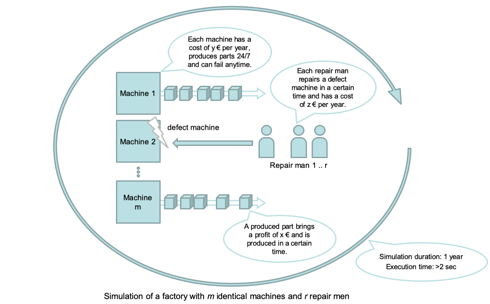
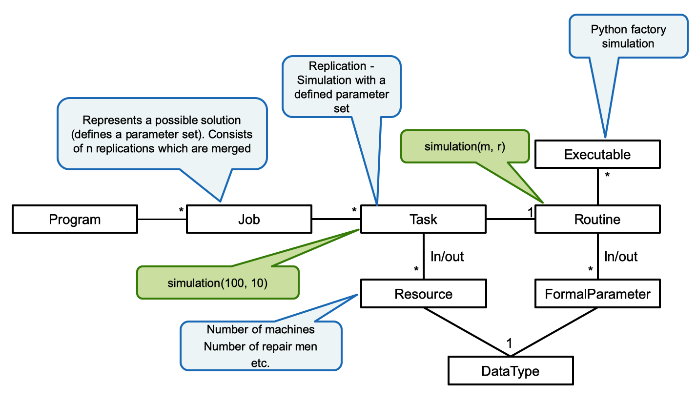
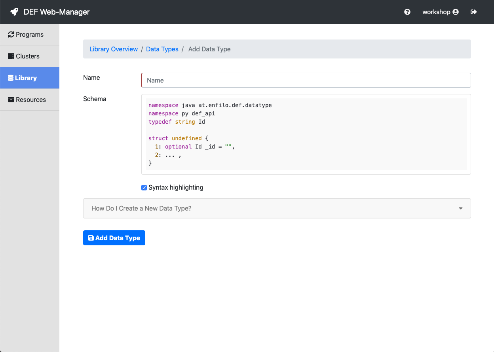
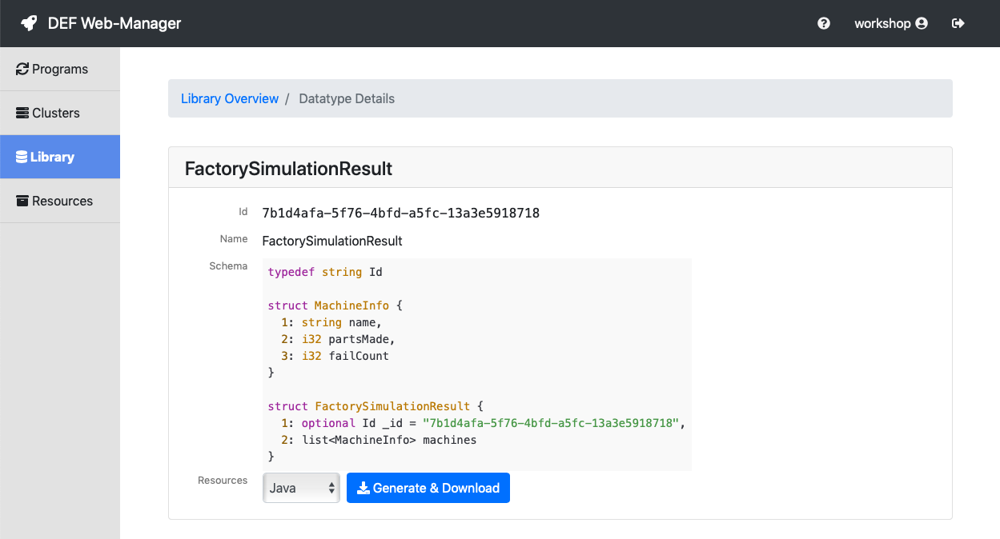
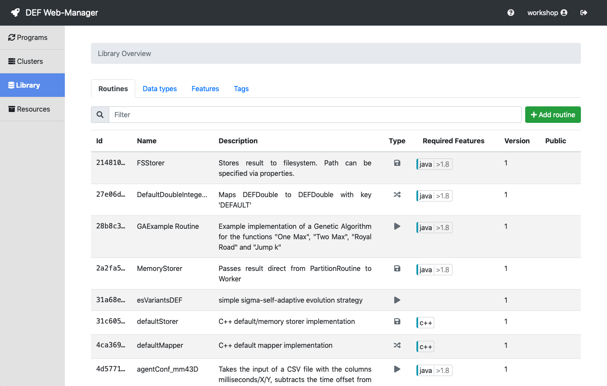
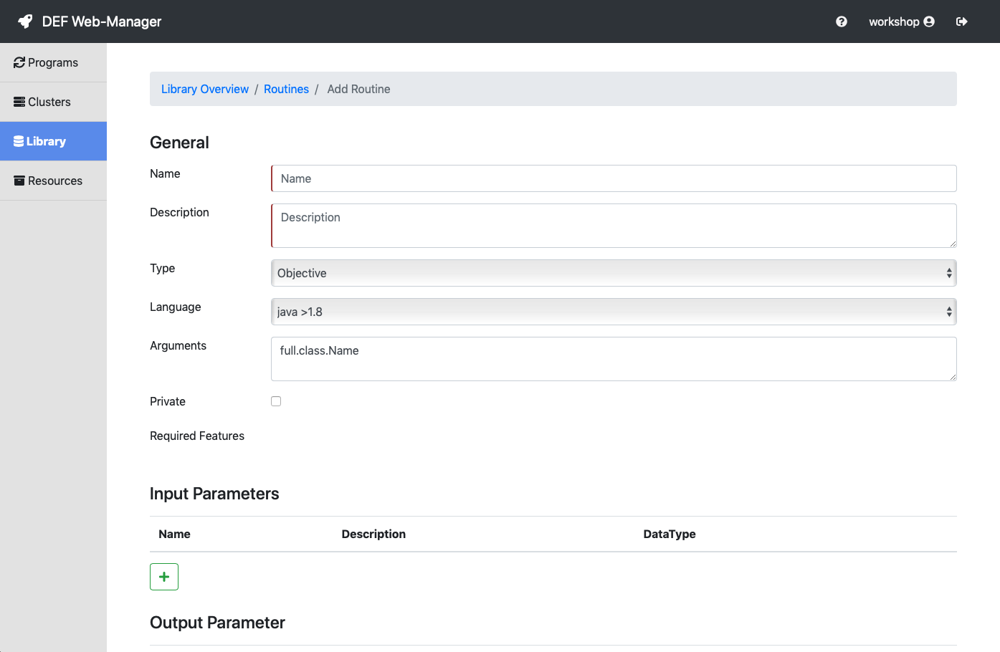
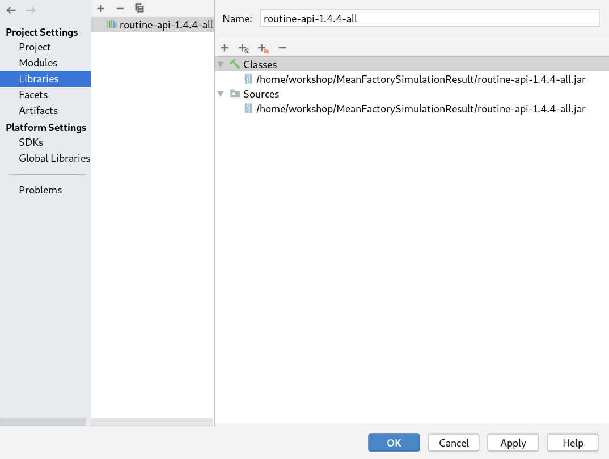
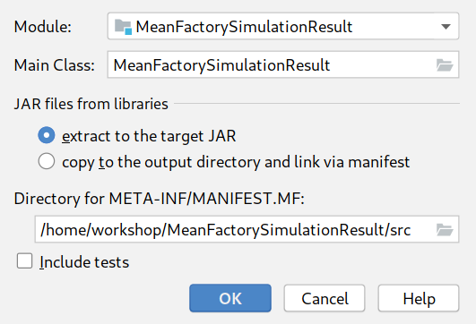

.. include:: ../../isonum.txt
.. role::  raw-html(raw)
    :format: html

.. _tutorial_factory:

======================
DEF-Tutorial: Routines
======================

This tutorial was created for the DEF workshop held on June 17th, 2019 and has the aim to introduce the Distributed Execution Framework (DEF), which was developed in the Josef Ressel Centre for Applied Scientific Computing, to other researches at the FHV.

Goals of this tutorial
=======================

This tutorial isn't intended to show the whole functionality the DEF offers, but to give a first introduction into the concepts behind the DEF and the areas of application. To offer this a prepared problem is given which shall be computed on the DEF. Therefore the goals of this workshop are:

* Clarifying the motivation for developing and using the DEF
* Explaining the concepts behind the DEF
* Developing an :ref:`objective-routine` in Python for the given problem
* Developing a :ref:`reduce-routine` in Java for the given problem
* Uploading :ref:`Routines <routine>` with the DEF *Web-Manager*
* Developing a :ref:`client` in Java for the communication with the DEF
* Developing an optimisation for the given problem in Java

About
======

The DEF has been developed at the :ref:`jrz` at the `University of Applied Sciences Vorarlberg <https://www.fhv.at/en/>`_.

.. _def:

Distributed Execution Framework (DEF)
======================================

Motivation
-----------

There have been two main motivations for developing and using the DEF, namely the reusability of algorithms independent
of programming languages and runtime environments, and the parallel and distributed execution of computational problems.

For more information read the chapter :ref:`def-motivations`.

Domain & Terminology
----------------------

The problems that can be computed on the DEF have to be embarrassingly parallel and be put in a specific structure.

For more information read the chapter :ref:`def-domain`.

DEF Components
--------------

As the name states the DEF is a distributed system with many different components.

For more information read the chapter :ref:`components`.

FHV Environment
---------------

A DEF instance is maintained at the FHV. You can find the connection data in :ref:`fhv-env`.

Factory Simulation & Optimisation
==================================

For demonstrating the usage and functionality of the DEF a simple factory simulation is taken as an example. The goal is to optimize the profit :math:`P` of a factory with :math:`m` identical machines and :math:`r` repair men. Each machine and repair man has a given cost. A predefined budget is given which must not be exceeded.

This example contains two main parts:

* Simulation: Simulates the factory with a specific setup
* Optimisation: Optimizes the factory setup for gaining the highest profit

Simulation
-----------

The factory simulation is borrowed from `SimPy - Machine Shop <https://simpy.readthedocs.io/en/latest/examples/machine_shop.html>`_ with some modifications.

In short, a factory with :math:`m` identical machines produces identical parts. Every part is done in a specified average time and a machine can crash at any time. The factory employs a specific number of repair men which are responsible for repairing broken machines.

The following parameters can be defined for the simulation:

================ ====== ========================================================
Parameter        Unit   Description
================ ====== ========================================================
m                       Number of machines
r                       Number of repair men
ptMean           min    Process time of a part - normal distributed, mean part
ptSigma          min    Process time of a part - normal distributed, sigma part
mttf             min    Mean time to fail (crash of a machine)
repairTime       min    Repair time of a machine
weeks            week   Simulation duration
================ ====== ========================================================

The factory simulation produces the following output:

* Number of produced parts (:math:`p_i`) for every machine (:math:`m_i`)
* Number of fails/crashes (:math:`f_i`) for every machine (:math:`m_i`)

One simulation run is executed with a specific simulation setup which defines the parameters above and returns one output.

The code of this simulation will be introduced later on in this tutorial.

.. _optimisation-theory:

Optimisation
-------------

To determine the best simulation setup for the factory simulation an optimisation is used. The goal of the optimisation is to approach the highest possible profit :math:`P`.

To calculate the profit of a factory setup the following variables are introduced:

=========== ================================================ =================
Name        Definition                                       Source
=========== ================================================ =================
:math:`P`   profit
:math:`m`   number of machines                               simulation input
:math:`r`   number of repair men                             simulation input
:math:`p_i` number of produced parts per machine :math:`m_i` simulation output
:math:`P_p` profit per produced part                         specified before
:math:`c_m` costs per machine per year                       specified before
:math:`c_r` costs per repair man per year                    specified before
:math:`b`   available budget for machines and repair men     specified before
=========== ================================================ =================

With that the profit is calculated as following:

:math:`P = P_p \sum_{i=1}^m p_i - (c_m m + c_r r)`

The following constraint has to be satisfied:

:math:`(c_m m + c_r r) <= b`

For optimizing the profit different strategies can be used. One of them will be introduced later on in this tutorial.

Bringing the Factory Simulation & Optimisation in the DEF Structure
===================================================================

As already stated above to compute a problem with the DEF it has to be put in a specific structure. The image below shows which part of the simulation represents which domain structure part in the DEF.

The **Python factory simulation** itself is the **executable** which is executed on the *Workers*.

**One simulation run with a defined parameter set** is represented by one **task**.

**A parameter set** with all the input parameters the Python simulation needs, as number of machines, number of repair men etc. are the **resources** of the task.

One **job** represents a **possible solution with one defined parameter set**. This solution consists of n replications (tasks) which are merged together.

Once more for clarification: The **routine** defines the interface of the python simulation ``simulation(m, r)`` and the **task** actually calls the simulation ``simulation(100, 10)``.

Implementation
===============

Now that the general concepts of the DEF and the Factory Simulation & Optimisation are settled the implementation for computing the problem on the DEF can be made. This will be divided into different parts, first the Python simulation itself, afterwards the implementation and upload of this simulation as a DEF routine in Python, followed by the implementation of a DEF client in Java, the creation of a reduce routine in Java and finally the introduction of an optimisation algorithm also in Java.

Factory Simulation in Python
----------------------------

First of all we want to get familiar with the factory simulation written in python, independent of the DEF. The simulation code that is borrowed from `SimPy - Machine Shop <https://simpy.readthedocs.io/en/latest/examples/machine_shop.html>`_ can be seen below. For detailed information of the Python code visit the linked website.

.. literalinclude:: src/factory_simulation.py
    :language: python
    :linenos:

If this simulation code is run the following results are given.

.. literalinclude:: src/factory_simulation_result_unchanged.txt

To use this simulation as a DEF routine some adaptions have to be made.

#. Changing the random seed
#. Making it a computationally intensive problem
#. Adding more repair men
#. Changing input of the simulation
#. Adding method for starting simulation
#. Deleting global variables
#. Adding a fail count to every machine

Adaption 1: Changing the random seed
^^^^^^^^^^^^^^^^^^^^^^^^^^^^^^^^^^^^^

The problem with the results above is that you get exactly the same values each time you run the simulation. This is because the random seed used for generating random numbers is set to a specific value. In the simulation code this can be found in the following lines.

.. code-block:: python
    :linenos:
    :lineno-start: 23

    RANDOM_SEED = 42

.. code-block:: python
    :linenos:
    :lineno-start: 124

    random.seed(RANDOM_SEED)  # This helps reproducing the results

To ensure that random numbers created are distributed the mention lines have to be deleted from the simulation code.

Now every time the simulation is executed the results vary in a certain range.

Adaption 2: Making it a computationally intensive problem
^^^^^^^^^^^^^^^^^^^^^^^^^^^^^^^^^^^^^^^^^^^^^^^^^^^^^^^^^^^

The simulation as it is now is executed in a few milliseconds, which doesn't make it to a computationally intensive problem. But if we take a look at the defined variables in the simulation code it can be seen that the simulation includes only 10 machine and the simulation time is only 4 weeks.

.. code-block:: python
    :linenos:
    :lineno-start: 30

    NUM_MACHINES = 10
    WEEKS = 4                       # Simulation time in weeks
    SIM_TIME = WEEKS * 7 * 24 * 60  # Simulation time in minutes

To gain a result that is accurate enough for making decisions it is necessary to increase the simulation time, in our example to one year. Also the number of simulated machines will be increased to 100. The following lines has to be changed accordingly.

.. code-block:: python
    :linenos:
    :lineno-start: 30

    NUM_MACHINES = 100
    WEEKS = 52              # Simulation time in weeks

One simulation run is now with nearly 4 seconds (on our test computer) taking approximately 10 times longer than before.

Because of the fact that it is a stochastic problem it has also to be taken into account that it is necessary to execute a simulation with a specific parameter set many times to average over the results and gaining consequently a reliable value for further decisions.

This means if we consider to take this simulation code as a base for an optimization it is necessary to run the simulation over a long enough time and to run one simulation setup many times before changing the parameter set and continuing to the next one. This leads to a computationally intensive problem that can take advantage of parallel and distributed computing.

Adaption 3: Adding more repair men
^^^^^^^^^^^^^^^^^^^^^^^^^^^^^^^^^^^^

Currently the Python simulation runs with only one repair man, this can be seen by the ``capacity=1`` in the following line.

.. code-block:: python
    :linenos:
    :lineno-start: 128

    repairman = simpy.PreemptiveResource(env, capacity=1)

As the number of machines is increasing it might also be necessary to employee more repair men for maintaining the machines. For that a new variable is introduced which holds the number of repair men and the capacity of the above line is set with this variable. This leads to the following changes.

.. code-block:: python
    :linenos:
    :lineno-start: 33

    NUM_REPAIR_MEN = 2      # Number of repair men in the machine shop

.. code-block:: python
    :linenos:
    :lineno-start: 128

    repairman = simpy.PreemptiveResource(env, capacity=NUM_REPAIR_MEN)

As a variable is now present which holds the number of repair men it can be altered easily.

Adaption 4: Changing input of the simulation
^^^^^^^^^^^^^^^^^^^^^^^^^^^^^^^^^^^^^^^^^^^^^

To eventually run an optimisation over the factory simulation it is necessary that the input parameters of the simulation can be changed.

To ensure that we want to extend the initialisation of the machines to use given parameters instead of global variables. For that the constructor of the Machine object has to be extended like following.

.. code-block:: python
    :linenos:
    :lineno-start: 54

    def __init__(self, env, name, repairman, pt_mean, pt_sigma, mttf, repair_time):
        self.env = env
        self.name = name
        self.parts_made = 0
        self.broken = False
        self.pt_mean = pt_mean          # added
        self.pt_sigma = pt_sigma        # added
        self.mttf = mttf                # added
        self.repair_time = repair_time  # added

        # Start "working" and "break_machine" processes for this machine.
        self.process = env.process(self.working(repairman))
        env.process(self.break_machine())

For now the global variables are used in the constructor call but will be eliminated further on.

.. code-block:: python
    :linenos:
    :lineno-start: 129

    machines = [Machine(env=env, name='Machine %d' % i, repairman=repairman, pt_mean=PT_MEAN, pt_sigma=PT_SIGMA, mttf=MTTF, repair_time=REPAIR_TIME)
                for i in range(NUM_MACHINES)]

pt_mean & pt_sigma
''''''''''''''''''

pt_mean is the average time a machine needs to process one part in minutes. pt_sigma is the sigma of the processing time distribution.

To use the given input parameter instead of the global variable in the simulation code the following lines have to be changed.

.. code-block:: python
    :linenos:
    :lineno-start: 35

    def time_per_part(pt_mean, pt_sigma):
        """Return actual processing time for a concrete part."""
        return random.normalvariate(pt_mean, pt_sigma)

.. code-block:: python
    :linenos:
    :lineno-start: 73

    done_in = time_per_part(self.pt_mean, self.pt_sigma)

mttf
''''

mttf is the mean time to failure of a machine in minutes.

To use the given input parameter instead of the global variable in the simulation code the following lines have to be changed.

.. code-block:: python
    :linenos:
    :lineno-start: 40

    def time_to_failure(mttf):
        """Return time until next failure for a machine."""
        return random.expovariate(1/mttf)

.. code-block:: python
    :linenos:
    :lineno-start: 98

    yield self.env.timeout(time_to_failure(self.mttf))

repair_time
'''''''''''

repair_time is the time a repair man needs to repair a machine in minutes.

To use the given input parameter instead of the global variable in the simulation code the following line has to be changed. Please note that now the input parameters are used for further initialisation, not the global variables anymore.

.. code-block:: python
    :linenos:
    :lineno-start: 88

    yield self.env.timeout(self.repair_time)

job_duration
''''''''''''

job_duration gives the duration of other jobs in minutes. This parameter isn't used by the machine itself but to simulate that the repair men are also doing other jobs besides repairing machines.

To use an input parameter as job duration instead of the global variable in the simulation code the following lines have to be changed.

.. code-block:: python
    :linenos:
    :lineno-start: 104

    def other_jobs(env, repairman, job_duration):
        """The repairman's other (unimportant) job."""
        while True:
            # Start a new job
            done_in = job_duration
            while done_in:
                # Retry the job until it is done.
                # It's priority is lower than that of machine repairs.
                with repairman.request(priority=2) as req:
                    yield req
                    try:
                        start = env.now
                        yield env.timeout(done_in)
                        done_in = 0
                    except simpy.Interrupt:
                        done_in -= env.now - start

Adaption 5: Adding method for starting simulation
^^^^^^^^^^^^^^^^^^^^^^^^^^^^^^^^^^^^^^^^^^^^^^^^^

The next step is to build a method for starting the execution of the simulation. All variables needed for the execution are input parameters for this method so they can be given from outside the simulation code. Additionally it is necessary to give the method a return value we are interested in, namely the machines. The method is created by changing the following lines.

.. code-block:: python
    :linenos:
    :lineno-start: 122

    def run_factory_simulation(m, r, pt_mean, pt_sigma, mttf, repair_time, simulation_weeks, job_duration):
        # Setup and start the simulation
        print('Machine shop')

        # Create an environment and start the setup process
        env = simpy.Environment()
        repairman = simpy.PreemptiveResource(env, capacity=r)
        machines = [Machine(env=env, name='Machine %d' % i, repairman=repairman, pt_mean=pt_mean, pt_sigma=pt_sigma, mttf=mttf, repair_time=repair_time)
                    for i in range(m)]
        env.process(other_jobs(env, repairman, job_duration))

        # Execute!
        sim_time = simulation_weeks * 7 * 24 * 60
        env.run(until=sim_time)

        # Analyis/results
        print('Machine shop results after %s weeks' % simulation_weeks)
        for machine in machines:
            print('%s made %d parts.' % (machine.name, machine.parts_made))

        return machines

Adaption 6: Deleting global variables
''''''''''''''''''''''''''''''''''''''

Now that they aren't needed anymore all global variables can be deleted. For that the following lines can be deleted.

.. code-block:: python
    :linenos:
    :lineno-start: 23

    PT_MEAN = 10.0         # Avg. processing time in minutes
    PT_SIGMA = 2.0         # Sigma of processing time
    MTTF = 300.0           # Mean time to failure in minutes
    BREAK_MEAN = 1 / MTTF  # Param. for expovariate distribution
    REPAIR_TIME = 30.0     # Time it takes to repair a machine in minutes
    JOB_DURATION = 30.0    # Duration of other jobs in minutes
    NUM_MACHINES = 10      # Number of machines in the machine shop
    WEEKS = 4              # Simulation time in weeks
    SIM_TIME = WEEKS * 7 * 24 * 60  # Simulation time in minutes
    NUM_REPAIR_MEN = 2     # Number of repair men in the machine shop

Adaption 7: Adding a fail count to every machine
''''''''''''''''''''''''''''''''''''''''''''''''''

It might be interesting for someone running the simulation how often each machine is broken down. For that a final adaption is made which adds a new variable ``fail_count`` to the ``Machine`` class, as seen below.

.. code-block:: python
    :linenos:
    :lineno-start: 54

    def __init__(self, env, name, repairman, pt_mean, pt_sigma, mttf, repair_time):
        self.env = env
        self.name = name
        self.parts_made = 0
        self.broken = False
        self.pt_mean = pt_mean          # added before
        self.pt_sigma = pt_sigma        # added before
        self.mttf = mttf                # added before
        self.repair_time = repair_time  # added before
        self.fail_count = 0             # added

Now every time the machine breaks down the ``fail_count`` is incremented.

.. code-block:: python
    :linenos:
    :lineno-start: 95

    def break_machine(self):
        """Break the machine every now and then."""
        while True:
            yield self.env.timeout(time_to_failure())
            if not self.broken:
                # Only break the machine if it is currently working.
                self.fail_count += 1        # added
                self.process.interrupt()

Resulting code
^^^^^^^^^^^^^^^

The code with all mentioned changes applied is shown below.

.. literalinclude:: src/factory_simulation_modified.py
    :language: python
    :linenos:

.. _tutorial-parameters:

Testing the simulation
^^^^^^^^^^^^^^^^^^^^^^^^

Finally we want to test the simulation code we adapted. For that we don't take the values given from the SimPy simulation but prefer a more realistic choice of values which are listed below.

.. code-block:: python

    m = 10                 # Number of machines in the machine shop
    r = 2                  # Number of repair men in the machine shop
    pt_mean = 60.0         # Avg. processing time in minutes
    pt_sigma = 0.1         # Sigma of processing time
    mttf = 7 * 24 * 60     # Mean time to failure in minutes
    repair_time = 4 * 60   # Time it takes to repair a machine in minutes
    job_duration = 30.0    # Duration of other jobs in minutes
    simulation_weeks = 52  # Simulation time in weeks

These values will be reused later on in this tutorial.

To test the simulation code we add a new line at the end of the file.

.. code-block:: python
    :linenos:
    :lineno-start: 136

    run_factory_simulation(m=10, r=2, pt_mean=60.0, pt_sigma=0.1, mttf=7*24*60, repair_time=4*60, simulation_weeks=52, job_duration=30.0)

When running the simulation with these values the following results are given.

.. literalinclude:: src/factory_simulation_result_modified.txt

These results should be remembered for later on to have values for comparison.

Now we are finished adapting the simulation code to our needs.

.. _objective-routine-java:

Bringing the factory simulation in Python into the DEF
-------------------------------------------------------

To bring the factory simulation into the DEF there are several steps necessary which are described below.

Data types
^^^^^^^^^^

The DEF data types are used for the communication between the different components and across programming languages.
It is necessary to create data types for all the input and output data of the routine. For more information on data types see :ref:`data-type`.

The data types for the above defined parameters are the following.

=================== =============
Parameter           Data Type
=================== =============
m                   DEFInteger
r                   DEFInteger
ptMean              DEFDouble
ptSigma             DEFDouble
mttf                DEFDouble
repairTime          DEFDouble
jobDuration         DEFDouble
weeks               DEFInteger
=================== =============

Creating a new DEF data type
'''''''''''''''''''''''''''''

Additionally to the already existing data types the DEF offers the opportunity to create own data types. This is also necessary for our factory simulation.

To create a new data type the **Add data type** button in the *Data types* tab in the *Library* section has to be clicked which opens the below displayed site.

For the factory simulation the data type **FactorySimulationResult** with the nested data type **MachineInfo** has to be created. For that *FactorySimulationResult* has to be written into the *Name* field and the following code into the *Schema* field.

.. _factory-simulation-result:

.. code-block:: thrift

    typedef string Id

    struct MachineInfo {
      1: string name,
      2: i32 partsMade,
      3: i32 failCount
    }

    struct FactorySimulationResult {
      1: optional Id _id = "",
      2: list<MachineInfo> machines
    }

**Caution: The _id in the schema definition has to be left empty because the DEF will afterwards give the data type an unique ID**.

After clicking the *Add Data Type* button the newly created data type is shown in the data types list.

Programming the DEF routine in Python
^^^^^^^^^^^^^^^^^^^^^^^^^^^^^^^^^^^^^^

The DEF offers different types of routines which are

* :ref:`objective-routine`
* :ref:`map-routine`
* :ref:`reduce-routine`
* Store Routine

For this example the only routine type that is important for now is the *Objective routine*.

To put it simply, any *Objective Routine* is used for any individual computations a user wants to execute in the DEF. This means that an *Objective Routine* has to be created for the factory simulation to execute it with the DEF. For that the following steps have to be taken.

#. Download and install Python DEF-API
#. Downloading the needed data types
#. Downloading the corresponding *Objective Routine* template
#. Programming the *Objective Routine* for the factory simulation
#. Building the executables of the *Objective Routine*

Routine Step 1: Download and install Python DEF-API
'''''''''''''''''''''''''''''''''''''''''''''''''''''

The API's for all supported languages can be found in *Resources* section of *Web-Manager* (see :ref:`fhv-env`). Download the Python Client/Routine API and follow the installation steps:

.. code-block:: bash

    $ unzip client-routine-api-1.4.4.zip
    $ cd python
    $ pip install . --user --upgrade

Routine Step 2: Downloading the needed data types
'''''''''''''''''''''''''''''''''''''''''''''''''''

The first step in the programming the DEF routine is to download the previously generated data type *FactorySimulationResult*. This can be done by opening the details view of the data type in the data types list in the *Web-Manager*, selecting *Python* in the drop down list and clicking on the *Generate & Download* button that is shown in the image below.

The downloaded zip file has to be decompressed and the contained file ``ttypes.py`` has to be saved for later.

Routine Step 3: Downloading the corresponding *Objective Routine* template
'''''''''''''''''''''''''''''''''''''''''''''''''''''''''''''''''''''''''''

As the factory simulation is written in Python the :download:`Python Routine Template <../resources/python_routine_template.zip>` can be used for creating the *Objective Routine*.

After downloading it the file has to be unzipped and the project directory can be renamed to a more accurate title like *factory_simulation-routine*. The following files are contained in the project.

* ``__main__.py`` : contains the entry point for the execution
* ``build-routine_binary.sh``: is a shell script for creating the executable of the project
* ``demo-routines.py``: shows how an *Objective Routine* can be implemented. It can be left in the project for reference or it can be deleted
* Directory ``routine_api``: the DEF API for creating routines

Routine Step 4: Programming the :ref:`objective-routine` for the factory simulation
'''''''''''''''''''''''''''''''''''''''''''''''''''''''''''''''''''''''''''''''''''''

The first step is to create a file with the name ``factory_simulation.py`` and copy the previously implemented factory simulation code in there.

**Caution:** Don't forget to remove or comment to line at the end of the file that was added for testing the routine.

.. code-block:: python
    :linenos:
    :lineno-start: 136

    run_factory_simulation(m=10, r=2, pt_mean=60.0, pt_sigma=0.1, mttf=7*24*60, repair_time=240.0, simulation_weeks=52, job_duration=30.0)

Now the previously downloaded ``ttypes.py`` which contains the created data type *FactorySimulationResult* has to be added to the project as well.

Next another empty Python file with the name ``factory_simulation-routine.py`` has to be created. The project structure now looks like following.

* ``__main__.py``: contains the entry point for the execution
* ``build-routine_binary.sh``: is a shell script for creating the executable of the project
* ``factory_simulation-routine.py``: will be the *Objective Routine* further on
* ``factory_simulation.py``: contains the factory simulation code
* ``ttypes.py``: contains the downloaded data type *FactorySimulationResult*
* Directory ``routine_api``: the DEF API for creating routines

The next step is to program the *Objective Routine* in ``factory_simulation-routine.py``.
First a class that inherits from *ObjectiveRoutine* is created. The *__run__* method will perform three different tasks, namely fetching the needed parameters, starting the simulation and process and returning the results.

.. code-block:: python
    :linenos:

    from routine_api.def_api.routine.base import ObjectiveRoutine

    class FactorySimulation(ObjectiveRoutine):
        def __run___(selfs):
            # Step 1: Fetch parameters

            # Step 2: Start simulation

            # Step 3: Process and return results

The first task is to fetch all parameters that are needed for running the factory simulation. To fetch a parameter the following method can be used that is defined in the class *ObjectiveRoutine*.

.. code-block:: python

    parameter = self.__get_parameter__('parameter_name', ParameterDataType()).value

This method can be used for fetching all parameters needed for running the simulation. The code has to be extended like this. Note that another import statement is also added.

.. code-block:: python
    :linenos:

    from routine_api.def_api.routine.base import ObjectiveRoutine
    from routine_api.def_api.ttypes import DEFDouble, DEFInteger

    class FactorySimulation(ObjectiveRoutine):
        def __run___(selfs):
            # Step 1: Fetch parameters
            pt_mean = self.__get_parameter__('ptMean', DEFDouble()).value
            pt_sigma = self.__get_parameter__('ptSigma', DEFDouble()).value
            mttf = self.__get_parameter__('mttf', DEFDouble()).value
            repair_time = self.__get_parameter__('repairTime', DEFDouble()).value
            m = self.__get_parameter__('m', DEFInteger()).value
            r = self.__get_parameter__('r', DEFInteger()).value
            weeks = self.__get_parameter__('simulationWeeks', DEFInteger()).value
            job_duration = self.__get_parameter__('jobDuration', DEFDouble()).value

            # Step 2: Start simulation

            # Step 3: Process and return results

The second step includes starting the simulation with the fetched parameters. To do that the *run_factory_simulation* method from the factory simulation has to be imported and called with the corresponding values.

.. code-block:: python
    :linenos:

    from routine_api.def_api.routine.base import ObjectiveRoutine
    from routine_api.def_api.ttypes import DEFDouble, DEFInteger
    from factory_simulation import run_factory_simulation

    class FactorySimulation(ObjectiveRoutine):
        def __run___(self):
            # Step 1: Fetch parameters
            pt_mean = self.__get_parameter__('ptMean', DEFDouble()).value
            pt_sigma = self.__get_parameter__('ptSigma', DEFDouble()).value
            mttf = self.__get_parameter__('mttf', DEFDouble()).value
            repair_time = self.__get_parameter__('repairTime', DEFDouble()).value
            m = self.__get_parameter__('m', DEFInteger()).value
            r = self.__get_parameter__('r', DEFInteger()).value
            weeks = self.__get_parameter__('simulationWeeks', DEFInteger()).value
            job_duration = self.__get_parameter__('jobDuration', DEFDouble()).value

            # Step 2: Start simulation
            machines = run_factory_simulation(pt_mean=pt_mean, pt_sigma=pt_sigma, mttf=mttf, repair_time=repair_time, m=m,
                                              r=r, simulation_weeks=weeks, job_duration=job_duration)

            # Step 3: Process and return results

At last it is necessary to convert the results of the simulation into the previously created DEF data type *FactorySimulationResult*.

.. code-block:: python
    :linenos:

    from routine_api.def_api.routine.base import ObjectiveRoutine
    from routine_api.def_api.ttypes import DEFDouble, DEFInteger
    from factory_simulation import run_factory_simulation
    from ttypes import FactorySimulationResult, MachineInfo

    class FactorySimulation(ObjectiveRoutine):
        def __run___(self):
            # Step 1: Fetch parameters
            pt_mean = self.__get_parameter__('ptMean', DEFDouble()).value
            pt_sigma = self.__get_parameter__('ptSigma', DEFDouble()).value
            mttf = self.__get_parameter__('mttf', DEFDouble()).value
            repair_time = self.__get_parameter__('repairTime', DEFDouble()).value
            m = self.__get_parameter__('m', DEFInteger()).value
            r = self.__get_parameter__('r', DEFInteger()).value
            weeks = self.__get_parameter__('simulationWeeks', DEFInteger()).value
            job_duration = self.__get_parameter__('jobDuration', DEFDouble()).value

            # Step 2: Start simulation
            machines = run_factory_simulation(pt_mean=pt_mean, pt_sigma=pt_sigma, mttf=mttf, repair_time=repair_time, m=m,
                                              r=r, simulation_weeks=weeks, job_duration=job_duration)

            # Step 3: Process and return results
            mis = []
            for machine in machines:
                mi = MachineInfo()
                mi.name = machine.name
                mi.partsMade = machine.parts_made
                mi.failCount = machine.fail_count
                mis.append(mi)

            return FactorySimulationResult(machines = mis)

Routine Step 5: Building the executables of the *Objective Routine*
''''''''''''''''''''''''''''''''''''''''''''''''''''''''''''''''''''

For uploading a routine to the DEF it is necessary to build an executable first which contains all necessary files. In case of Python this can be a simple zip file which can be generated by executing the provided shell script ``build-routine_binary.sh`` in the project.

.. code-block:: shell

    $ sh build-routine_binary.sh

This creates a file with the name ``routine_binary.pyz`` in the same directory which can be uploaded in the next step.

.. _uploading-routine:

Uploading the *Objective Routine* into the DEF Library
^^^^^^^^^^^^^^^^^^^^^^^^^^^^^^^^^^^^^^^^^^^^^^^^^^^^^^^

The previously created routine binary can now be uploaded into the DEF Library. This can be done with the *Web-Manager*. In the *Library* section (see :ref:`fhv-env`) all uploaded routines are listed as seen in the picture below.

To upload a new routine the *Add routine* button has to be clicked which opens the following form.

This form has to be filled with the following values.

* *Name*: FactorySimulation
* *Description*: The profit of a factory with m identical machines and r repair men is optimized. Each machine and repair man has a given cost. A predefined budget is given which must not be exceeded.
* *Type*: Objective
* *Language*: Python >3.6
* *Extensions*: [none]
* *Arguments*: [empty]
* *Private*: [not toggled]
* *Input Parameters*:

    =============== ================================================================== =================
    Name            Description                                                         Data Type
    =============== ================================================================== =================
    m               Number of machines                                                  DEFInteger
    r               Number of repair men                                                DEFInteger
    ptMean          Process time of a single part - normally distributed, mean part     DEFDouble
    ptSigma         Process time of a single part - normally distributed, sigma part    DEFDouble
    mttf            Mean time to fail (crash of machine)                                DEFDouble
    repairTime      Repair time of a machine                                            DEFDouble
    jobDuration     Duration of other jobs in minutes                                   DEFDouble
    weeks           Simulation duration                                                 DEFInteger
    =============== ================================================================== =================

* *Output Parameter*:

    =============== ================================================================== ========================
    Name            Description                                                         Data Type
    =============== ================================================================== ========================
    result          For every machine: number of produced parts and fails/crashes       FactorySimulationResult
    =============== ================================================================== ========================

* *Binaries*: [search the previously created ``routine_binary.pyz`` and select it]

To start the upload of the routine click on the *Submit* button at the end of the form. When the routine was successfully uploaded it is listed in the *Routines* tab in the *Library* section.

.. _java-client:

Client in Java
---------------
To check the correct functionality of the previous created and uploaded :ref:`objective-routine` **FactorySimulation** a sample :ref:`Client <client>` in Java will be created.
This :ref:`Client <client>` will call the :ref:`objective-routine` **FactorySimulation** a few times with the noted parameter set before. (see :ref:`tutorial-parameters`)

For the detailed description on how to create a DEF client in Java see :ref:`clients-java`. There the following steps are described:

#. Create an empty Java project with the Client-API
#. Copy the example client code from the Web-Manager into the project
#. Generate and download all necessary DataTypes
#. Update the DEF connection data
#. Update Job and Task loops
#. Adapt input parameter values
#. Fetch and analyse the results
#. Playing around with the client

Client step 1: Create an empty Java project with the Client-API
^^^^^^^^^^^^^^^^^^^^^^^^^^^^^^^^^^^^^^^^^^^^^^^^^^^^^^^^^^^^^^^^

An empty Java project has to be created using your favourite IDE and the Client-API has to be imported as described in
:ref:`clients-java_step1`.

Client step 2: Copy client example code
^^^^^^^^^^^^^^^^^^^^^^^^^^^^^^^^^^^^^^^

The second step is to copy the example code for the **FactorySimulation** routine from the Web-Manager and include it into
the newly created project as described in :ref:`clients-java_step2`.

Client step 3: Generate and download :ref:`DataTypes <data-types-detail>`
^^^^^^^^^^^^^^^^^^^^^^^^^^^^^^^^^^^^^^^^^^^^^^^^^^^^^^^^^^^^^^^^^^^^^^^^^

The necessary data types can be downloaded from the Web-Manager as well and need to be integrated into the previously created
project as described in :ref:`clients-java_step3`.

Client step 4: Update DEF connection data
^^^^^^^^^^^^^^^^^^^^^^^^^^^^^^^^^^^^^^^^^

The connection data needs to be set according to the used DEF instance as described in :ref:`clients-java_step4`. For this example the following
data needs to be set:

.. code-block:: java
    :linenos:
    :lineno-start: 19

    // Create client
    ServiceEndpointDTO managerEndpoint = new ServiceEndpointDTO("10.0.50.53", 40002, Protocol.THRIFT_TCP);
    IDEFClient defClient = DEFClientFactory.createClient(managerEndpoint);

    // Create program
    Future<String> fPId = defClient.createProgram("cluster1", "workshop");
    String pId = fPId.get();

Client step 5: Update number of :ref:`Jobs <job>` and :ref:`Tasks <task>`
^^^^^^^^^^^^^^^^^^^^^^^^^^^^^^^^^^^^^^^^^^^^^^^^^^^^^^^^^^^^^^^^^^^^^^^^^

The loops need to be completed by defining abortion criteria as described in :ref:`clients-java_step5`.

Client step 6: Adapt input parameter values
^^^^^^^^^^^^^^^^^^^^^^^^^^^^^^^^^^^^^^^^^^^

The input parameters for the routine have to be filled with actual data. In this case the values are used that were
previously noted (see :ref:`tutorial-parameters`).

.. code-block:: java
    :linenos:
    :lineno-start: 27

    for (int j = 0; j < 1; j++) { // create only one job
        // Create Job.
        Future<String> fJId = defClient.createJob(pId);
        String jId = fJId.get();
        for (int t = 0; t < 1; t++) { // create only one task
            RoutineInstanceDTO routine = new RoutineInstanceBuilder("<FactorySimulation routine id>")
                    .addParameter("repairTime", new DEFDouble(240.0))
                    .addParameter("weeks", new DEFInteger(52))
                    .addParameter("mttf", new DEFDouble(10080.0))
                    .addParameter("m", new DEFInteger(10))
                    .addParameter("r", new DEFInteger(2))
                    .addParameter("ptSigma", new DEFDouble(60.0))
                    .addParameter("ptMean", new DEFDouble(0.1))
                    .build();
            defClient.createTask(pId, jId, routine);
        }
        // ..

Client step 7: Fetch and analyse the results
^^^^^^^^^^^^^^^^^^^^^^^^^^^^^^^^^^^^^^^^^^^^

Finally the results need to be fetched and analysed / processed as described in :ref:`clients-java_step7`.
This leads to this resulting overall code:

.. literalinclude:: Example.java
    :linenos:
    :language: java

.. _java-client-code:

Client step 8: Playing around with the client
^^^^^^^^^^^^^^^^^^^^^^^^^^^^^^^^^^^^^^^^^^^^^

In a next step the number of :ref:`Tasks <task>` will be increased to e.g. 40 (Number of cores available in test environment):

.. code-block:: java
    :linenos:
    :lineno-start: 31

    for (int t = 0; t < 40; t++) {

The runtime of the client ``Example.java`` should have nearly the same execution than with one :ref:`task`. But instead of running one simulation 40 will be executed in parallel.

If both lines which deletes the created :ref:`job` and :ref:`program` are commented out, all resources will be kept in DEF for a later use:

.. code-block:: java
    :linenos:
    :lineno-start: 56

        //defClient.deleteJob(pId, jId); // Optional
        }

    defClient.markProgramAsFinished(pId);
    //defClient.deleteProgram(pId); // Optional: Delete all resources

It's also possible to separate the client into two parts as described in :ref:`clients-java_two-parts`.

.. _reduce-routine-java:

Reduce Routine in Java
----------------------

To create a single result for one *Job*, which is representing one parameter set and includes :math:`n` *Tasks*, we will create a :ref:`reduce-routine`. This *Reduce Routine* (from now on called **MeanFactorySimulationResult**) reduces :math:`n` results to one single result by taken the middle of ``partsMade`` and ``failCount`` (see :ref:`FactorySimulationResult <factory-simulation-result>`).

Before we start to implement the *Reduce Routine*, the following behavior should be known: After every :ref:`objective-routine` a :ref:`map-routine` will be executed, if no *Map Routine* is explicit defined a default *Map Routine* will be taken.
A *Map Routine* produces key-value pairs from the *Objective Routines* result, in case of the default *Map Routine* it's only one pair with the key ``DEFAULT`` and the value is the untouched *Objective Routines* result.
For the **MeanFactorySimulationResult** we are expecting ``FactorySimulationResult`` as value type and any key.

In this tutorial we are going to take *Java* as language to implement **MeanFactorySimulationResult**.

Steps to create a *Reduce Routine*:

#. Create an empty Java project with Routine-API
#. Download and include ``FactorySimulationResult`` data type
#. Implement reduce logic
#. Upload and register **MeanFactorySimulationResult**
#. Modify the Client to use **MeanFactorySimulationResult**

Reduce Routine step 1: Create an empty Java project
^^^^^^^^^^^^^^^^^^^^^^^^^^^^^^^^^^^^^^^^^^^^^^^^^^^

As a first step an empty Java project with the name **MeanFactorySimulationResult** should be created in your favorite IDE (`IntelliJ IDEA <https://www.jetbrains.com/idea/?fromMenu>`_ is used in this Tutorial).
To create a :ref:`reduce-routine` for the DEF the Routine-API must be added to the new created project:

#. Download Routine-API from *Web-Manager* :raw-html:`&rarr;` *Resources*. (See :ref:`fhv-env`, Filename: ``routine-api-<version>-all.jar``)
#. Place the downloaded file to the project root.
#. In IntelliJ IDEA right click to the project and choose *Open Module Settings* (*F4*).
#. Switch to *Libraries* and add ``routine-api-<version>-all.jar``. (see image below)

Reduce Routine step 2: Include data type
^^^^^^^^^^^^^^^^^^^^^^^^^^^^^^^^^^^^^^^^

In the second step, the needed data type :ref:`FactorySimulationResult <factory-simulation-result>` will be integrated to the new project.

#. Navigate to the data type on the *Web-Manager*: *Library* :raw-html:`&rarr;` *Data types* :raw-html:`&rarr;` ``FactorySimulationResult``.
#. On the data type details page, choose *Java* and press *Generate & download* button.
#. Decompress the downloaded zip file ``Java_dataTypes.zip`` and copy all included ``*java`` Files to the ``src`` directory of the project.

Reduce Routine step 3: Implement reduce logic
^^^^^^^^^^^^^^^^^^^^^^^^^^^^^^^^^^^^^^^^^^^^^

As already mentioned above, the reduce logic should create the mean of :math:`n` ``FactorySimulationResult`` samples.
Every ``FactorySimulationResult`` contains a list of ``MachineInfo`` objects with the fields ``name``, ``partsMade`` and ``failCount``, whereby the name is unique and identifies a machine.

1. Create a new class file ``MeanFactorySimulationResult.java`` and extend the class from ``ReduceRoutine<FactorySimulationResult>``.
2. Implement the both abstract methods ``reduceValue`` and ``finalizeReduce`` and also the missing constructor:

.. code-block:: java
    :linenos:
    :lineno-start: 6

    public class MeanFactorySimulationResult extends ReduceRoutine<FactorySimulationResult> {

        public MeanFactorySimulationResult() {
            super(FactorySimulationResult.class);
        }

        @Override
        protected void reduceValue(String key, FactorySimulationResult value) {

        }

        @Override
        protected List<ITuple<String, FactorySimulationResult>> finalizeReduce() {
            return null;
        }
    }

3. Every time a :ref:`task` from a :ref:`job` with an attached *Reduce Routine* is finished, the result will be pushed to the *Reduce Routines* ``reduceValue()`` method.
In this method we will sum up the values of ``partsMade`` and ``failCount`` per machine and per key:

.. code-block:: java
    :linenos:
    :lineno-start: 7

    private final Map<String, Map<String, MachineInfo>> _values = new HashMap<>();
    private final Map<String, Map<String, Integer>> _counters = new HashMap<>();

    public MeanFactorySimulationResult() {
        super(FactorySimulationResult.class);
    }

    @Override
    protected void reduceValue(String key, FactorySimulationResult value) {
        // 1. check if key exists, otherwise create a new map
        if (!_values.containsKey(key)) {
            _values.put(key, new HashMap<>());
            _counters.put(key, new HashMap<>());
        }
        Map<String, MachineInfo> machineInfoSamples = _values.get(key);
        Map<String, Integer> sampleCounter = _counters.get(key);

        // 2. iterate through new given result (value) and sum up the fields partsMade and failCount and increase the counter
        for (MachineInfo mi : value.machines) {
            if (machineInfoSamples.containsKey(mi.name)) {
                machineInfoSamples.get(mi.name).partsMade += mi.partsMade;
                machineInfoSamples.get(mi.name).failCount += mi.failCount;
                sampleCounter.put(mi.name, sampleCounter.get(mi.name) + 1); // counter++
            } else {
                // first sample
                machineInfoSamples.put(mi.name, mi);
                sampleCounter.put(mi.name, 1);
            }
        }
    }

4. After all *Task* of a *Job* with an attached *Reduce Routine* are finished, the method ``finalizeReduce()`` will be called. This method provides the reduced result:

.. code-block:: java
    :linenos:
    :lineno-start: 38

    @Override
    protected List<ITuple<String, FactorySimulationResult>> finalizeReduce() {
        List<ITuple<String, FactorySimulationResult>> reducedResult = new LinkedList<>();

        // Iterate through all keys
        for (String key : _values.keySet()) {

            // Recreate FactorySimulationResult with mean values
            FactorySimulationResult factorySimulationResult = new FactorySimulationResult();

            Map<String, MachineInfo> machineInfoSamples = _values.get(key);
            Map<String, Integer> sampleCounter = _counters.get(key);
            for (Map.Entry<String, MachineInfo> e : machineInfoSamples.entrySet()) {
                String machineName = e.getKey();
                MachineInfo mi = e.getValue();
                int count = sampleCounter.get(machineName);
                // Calculate mean
                mi.partsMade /= count;
                mi.failCount /= count;

                factorySimulationResult.addToMachines(mi);
            }

            ITuple<String, FactorySimulationResult> tuple = new Tuple<>(key, factorySimulationResult);
            reducedResult.add(tuple);
        }

        return reducedResult;
    }

Reduce Routine step 4: Upload and register *MeanFactorySimulationResult*
^^^^^^^^^^^^^^^^^^^^^^^^^^^^^^^^^^^^^^^^^^^^^^^^^^^^^^^^^^^^^^^^^^^^^^^^

To upload and register the new **MeanFactorySimulationResult** *Reduce Routine*, the procedure is similar to adding a new *Objective Routine* to the DEF:

#. First, we will create an executable for the new *Reduce Routine*. In IntelliJ IDEA right click to the project and choose *Open Module Settings* (*F4*).
#. Switch to *Artifacts* and add *JAR* :raw-html:`&rarr;` *From modules with dependencies...*
#. Select *Main Class* ``MeanFactorySimulationResult``.

4. After adding the artifact, build the artifact: from menu choose *Build* :raw-html:`&rarr;` *Build Artifacts...* :raw-html:`&rarr;` *MeanFactorySimulationResult:jar* :raw-html:`&rarr;` *Build*.
#. The resulting artifact will be placed in ``out/artifacts/MeanFactorySimulationResult_jar/MeanFactorySimulationResult.jar`` and will be used in the next step as *Routine Binary File*.
#. Switch to *Web-Manager* (see :ref:`fhv-env`) *Library* section and press the *Add routine* button to add a new *Reduce Routine*.
#. At the *Add Routine* formular fill in the following values and add artifact under *Routine Binary Files*.

    ============= ===============================
    Name          ``MeanFactorySimulationResult``
    Description   ``TODO``
    Type          ``Reduce``
    Language      ``java > 1.8``
    Arguments     ``MeanFactorySimulationResult``
    Out Parameter ``FactorySimulationResult``
    ============= ===============================

8. After submitting the *Reduce Routine* note the ``Id`` of **MeanFactorySimulationResult** Routine.

Reduce Routine step 5: Modify *Client* for *MeanFactorySimulationResult*
^^^^^^^^^^^^^^^^^^^^^^^^^^^^^^^^^^^^^^^^^^^^^^^^^^^^^^^^^^^^^^^^^^^^^^^^

After uploading the *Reduce Routine* to the DEF library it can be used within the previously created client (see :ref:`java-client`).

For using the reduce routine it is necessary to make two adaptions to the client code, one when creating the jobs and one when fetching the results.

For demonstrating that the separated client code from :ref:`java-client-code` will be used.

In the first client code part for creating Jobs and Tasks the following line has to be added after creating a job.

.. code-block:: java
    :linenos:
    :lineno-start: 31

            // Create Job.
            Future<String> fJId = defClient.createJob(pId);
            String jId = fJId.get();
            System.out.printf("jId: %s\n", jId);

            // Attach reduce routine
            defClient.attachReduceRoutine(pId, jId, "<id of reduce routine>");

In the second client code part it isn't necessary anymore to fetch all Tasks with their results. The Job now holds the reduced value which might be enough for further calculations or considerations. This means that the following code

.. code-block:: java
    :linenos:
    :lineno-start: 28

        JobDTO job = defClient.waitForJob(pId, jId); // Blocking call: waits if job reach the state "SUCCESS" or "FAILED".
        if (job.getState() == ExecutionState.SUCCESS) {
            // Fetch all tasks and results.
            List<String> tIds = defClient.getAllTasksWithState(pId, jId, ExecutionState.SUCCESS, SortingCriterion.NO_SORTING).get();
            for (String tId : tIds) {
                TaskDTO task = defClient.getTask(pId, jId, tId).get();
                FactorySimulationResult result = defClient.extractOutParameter(task, FactorySimulationResult.class);
                // Process task result.
                System.out.println(result);
            }
        }

can be replaced by this.

.. code-block:: java
    :linenos:
    :lineno-start: 28

        JobDTO job = defClient.waitForJob(pId, jId); // Blocking call: waits if job reach the state "SUCCESS" or "FAILED".
        if (job.getState() == ExecutionState.SUCCESS) {
            // Fetch reduce result
            FactorySimulationResult reducedResult = defClient.extractReducedResult(job, FactorySimulationResult.class);
            System.out.println(reducedResult);
        }

Which leads to the whole client code looking like this.

.. literalinclude:: ExampleReducePart1.java
    :linenos:
    :language: java

.. literalinclude:: ExampleReducePart2.java
    :linenos:
    :language: java

.. _optimisation-java:

Optimisation in Java
---------------------

A DEF client can be developed to be very simple like the example :ref:`java-client` developed in this tutorial. But it is also possible to create a more sophisticated client which not only communicates with the DEF but also contains logic to react on the task or job results.

To give an example for that a DEF client is developed which aims to optimize the factory simulation in terms of the generated profit as described in the :ref:`optimisation-theory` chapter.

Optimisation algorithm
^^^^^^^^^^^^^^^^^^^^^^^^

The algorithm that is used for the optimisation is the simple 1+1 evolutionary strategy. An evolutionary strategy (ES) is a nature-inspired search and optimisation algorithm which represents possible solutions as individuals and uses mutation, recombination, and selection on them to produce better solutions iteratively.

The *1+1 ES* takes one possible solution which acts as the parent and creates exactly one offspring of the parent. Only if the offspring solution produces better results dependent on the desired outcome, the offspring becomes the new parent and is used for further evolution. If the offspring produces worse results then the parent stays parent for one more iteration. For more information about evolutionary strategies visit `Scholarpedia <http://www.scholarpedia.org/article/Evolution_strategies/>`_.

Programming the optimisation
^^^^^^^^^^^^^^^^^^^^^^^^^^^^^^

As basis for implementing the *1+1 ES* the :ref:`java-client` code is taken.

.. literalinclude:: Example.java
    :linenos:
    :language: java

The goal of the optimisation is to determine the most appropriate number of machines :math:`m` and repair men :math:`r` in order to optimise the profit :math:`P` of the factory constrained by a given budget :math:`b` for machine and repair men costs.
The following steps have to be taken to develop the optimisation algorithm.

#. Defining all necessary variables
#. Calculating the profit
#. Adding a generation loop
#. Creating jobs and tasks
#. Changing number of machines and repair men
#. Selecting new parent

Optimisation Step 1: Defining all necessary variables
''''''''''''''''''''''''''''''''''''''''''''''''''''''

For running the simulation some further variables are necessary. They can be divided into

- Variables used for the simulation
- Variables used for the optimisation
- Variables used for the optimisation algorithm

The variables used for the simulation contain the number of machines :math:`m` and the number of repair men :math:`r`.

The further values that are necessary for the optimisation are the profit per produced part :math:`P_p`, the budget :math:`b`, and the costs per machine per year (:math:`c_m`) and the costs per repair man per year (:math:`c_r`). The values for the optimisation are used to calculate the profit and won't change during the optimisation, they are therefore constants.

Additionally some variables are needed for the optimisation algorithm, like the maximal number of calculated generations, the number of replications per :math:`m` and :math:`r` combination and the currently best solution.

All needed variables are listed below.

.. code-block:: java
    :linenos:
    :lineno-start: 17

    public static void main(String[] args) throws Exception {
        // Variables used for simulation
        int m = 10;
        int r = 1;

        // Variables used for optimisation
        final double profitPerPart = 18.0;        // 18€ per part
        final double budget = 1000000;            // 1.000.000 € budget
        final double costPerRepairMan = 60000;    // cost per year
        final double costPerMachine = 50000;      // cost per year

        // Variables used for optimisation algorithm
        final int maxGenerations = 20;
        final int replications = 10;
        int currentGeneration = 0;          // generation count
        int[] bestSolution = new int[] {m, r}; // index 0 => m, index 1 => r
        double bestFitness = Double.MIN_VALUE;
        Random rnd = new Random();

        // ...

As :math:`m` and :math:`r` are going to change during the optimisation the defined variables are used as input parameters for the routine instead of fixed values.

.. code-block:: java
    :linenos:
    :lineno-start: 32

    RoutineInstanceDTO routine = new RoutineInstanceBuilder("<FactorySimulation routine id>")
            .addParameter("repairTime", new DEFDouble(240.0))
            .addParameter("weeks", new DEFInteger(weeks))   // changed
            .addParameter("mttf", new DEFDouble(10080.0))
            .addParameter("m", new DEFInteger(m))           // changed
            .addParameter("r", new DEFInteger(r))           // changed
            .addParameter("ptSigma", new DEFDouble(60.0))
            .addParameter("ptMean", new DEFDouble(0.1))
            .build();
    defClient.createTask(pId, jId, routine);

Optimisation Step 2: Calculating the profit
''''''''''''''''''''''''''''''''''''''''''''

The next step is to define a function that calculates the profit of the simulation result. The formula for calculating the profit is defined in the :ref:`optimisation-theory` chapter. The function takes as well care of the constraint which defines that the costs mustn't exceed a defined budget. If that's the case a value will be given back that represents the worst profit possible and therefore this solution won't be taken into account for further generations.

.. code-block:: java
    :linenos:
    :lineno-start: 64

    private static double calculateProfit(FactorySimulationResult result, double profitPerPart, double costPerMachine, double costPerRepairMan, int repairMen, double budget) {
        double cost = costPerMachine * result.machines.size() + costPerRepairMan * repairMen;
        if (cost > budget) {
            return Double.MIN_VALUE;
        }

        double profit = 0;
        for (MachineInfo machine : result.machines) {
            profit += machine.partsMade * profitPerPart;
        }
        return profit - cost;
    }

Optimisation Step 3: Adding a generation loop
''''''''''''''''''''''''''''''''''''''''''''''

To enable the results to evolve iteratively it is necessary to add a generation loop to the optimisation. As there is already a loop for creating the jobs in the example client this loop can be adapted to count the generations. The following line has to be changed accordingly.

.. code-block:: java
    :linenos:
    :lineno-start: 27

    for (int j = 0; j < 1; j++) {

.. code-block:: java
    :linenos:
    :lineno-start: 27

    for (currentGeneration = 0; currentGeneration < maxGenerations; currentGeneration++) {

Optimisation Step 4: Creating jobs and tasks
'''''''''''''''''''''''''''''''''''''''''''''''

Within the generation loop the jobs and tasks are created. Per generation and therefore per :math:`m` and :math:`r` combination one job is used.

As the factory simulation is a stochastically problem it is necessary to make some replications of the same factory simulation run and average over the results. This means that a task is one replication. All tasks of a job have the same input parameters and therefore it isn't necessary to define the routine data for every task but rather per job.

The calculation of the average mean can be made with the previously created :ref:`reduce-routine-java`. To do that the reduce routine has to be attached to the job.

The following code snippets show the specific code part before and after the mentioned changes.

.. code-block:: java
    :linenos:
    :lineno-start: 27

    // Create Job.
    Future<String> fJId = defClient.createJob(pId);
    String jId = fJId.get();
    for (int t = 0; t < 1; t++) { // create only one task
        RoutineInstanceDTO routine = new RoutineInstanceBuilder("<FactorySimulation routine id>")
                .addParameter("repairTime", new DEFDouble(240.0))
                .addParameter("weeks", new DEFInteger(52))
                .addParameter("mttf", new DEFDouble(10080.0))
                .addParameter("m", new DEFInteger(m))
                .addParameter("r", new DEFInteger(r))
                .addParameter("ptSigma", new DEFDouble(60.0))
                .addParameter("ptMean", new DEFDouble(0.1))
                .build();
        defClient.createTask(pId, jId, routine);
    }

.. code-block:: java
    :linenos:
    :lineno-start: 27

    // Create Job.
    Future<String> fJId = defClient.createJob(pId);
    String jId = fJId.get();

    // Attach reduce routine
    defClient.attachReduceRoutine(pId, jId, "<MeanFactorySimulationResult routine id>");

    RoutineInstanceDTO routine = new RoutineInstanceBuilder("<FactorySimulation routine id>")
            .addParameter("repairTime", new DEFDouble(240.0))
            .addParameter("weeks", new DEFInteger(52))
            .addParameter("mttf", new DEFDouble(10080.0))
            .addParameter("m", new DEFInteger(m))
            .addParameter("r", new DEFInteger(r))
            .addParameter("ptSigma", new DEFDouble(60.0))
            .addParameter("ptMean", new DEFDouble(0.1))
            .build();

    for (int t = 0; t < 1; t++) { // create only one task
        defClient.createTask(pId, jId, routine);
    }

Optimisation Step 5: Changing number of machines and repair men
''''''''''''''''''''''''''''''''''''''''''''''''''''''''''''''''

To create new :math:`m` and :math:`r` combinations that can be used for factory simulations runs it is necessary to take :math:`m` and :math:`r` of the current parent which is the so far best solution and change them in a certain range. This process is called mutation and is done for both :math:`m` and :math:`r` separately.

The mutation of the values is added after the reduce routine is attached to the job.

.. code-block:: java
    :linenos:
    :lineno-start: 35

     // Mutation
    if (rnd.nextDouble() < 0.5) {
        m = bestSolution[0] + rnd.nextInt(4);
    } else {
        m = bestSolution[0] - rnd.nextInt(4);
    }

    if (rnd.nextDouble() < 0.5) {
        r = bestSolution[1] + rnd.nextInt(2);
    } else {
        r = bestSolution[1] - rnd.nextInt(2);
    }

    // Guard
    m = m <= 0 ? 1 : m;
    r = r <= 0 ? 1 : r;

Optimisation Step 6: Selecting new parent
'''''''''''''''''''''''''''''''''''''''''''

At the end of every generation it is necessary to evaluate the results of the current factory simulation runs. To do that the reduced result of the job is taken and is passed to the function for calculating the profit with the previously defined values for costs, profit per produced part and budget.

If the calculated profit is higher than the so far best profit than currently set values for :math:`m` and :math:`r` and the just calculated profit are saved as new parent for the next generation. If the calculated profit is lower than the one of the current parent than that parent stays parent for the next generation.

To check that and select the parent for the next generation the following code has been adapted to the code below.

.. code-block:: java
    :linenos:
    :lineno-start: 46

    if (job.getState() == ExecutionState.SUCCESS) {
        // Fetch all tasks and results.
        List<String> tIds = defClient.getAllTasksWithState(pId, jId, ExecutionState.SUCCESS, SortingCriterion.NO_SORTING).get();
        for (String tId : tIds) {
            TaskDTO task = defClient.getTask(pId, jId, tId).get();
            FactorySimulationResult result = defClient.extractOutParameter(task, FactorySimulationResult.class);
            // Process task result.
            System.out.println(result);
        }
    }

.. code-block:: java
    :linenos:
    :lineno-start: 46

    if (job.getState() == ExecutionState.SUCCESS) {
        FactorySimulationResult reducedResult = defClient.extractReducedResult(job, FactorySimulationResult.class);
        double fitness = calculateProfit(reducedResult, profitPerPart, costPerMachine, costPerRepairMan, r, budget);
        if (fitness >= bestFitness) {
            bestFitness = fitness;
            bestSolution[0] = m;
            bestSolution[1] = r;
            System.out.println("  Found new best solution: profit=" + fitness + " m=" + m + " r=" +r);
        }
    }

Resulting code
'''''''''''''''

All of the above mentioned adaptions lead to the following code for the optimisation of the factory routine. After computing the given number of generations the best values for :math:`m` and :math:`r` that could be found are printed in the console.

.. literalinclude:: src/factory_optimisation.java
    :language: java
    :linenos:

Summary
===============

This tutorial has covered the following topics:

* Clarifying the motivation for developing and using the DEF (see :ref:`def`)
* Explaining the concepts behind the DEF (see :ref:`def`)
* Developing an :ref:`objective-routine` in Python for the given problem (see :ref:`objective-routine-java`)
* Developing a :ref:`reduce-routine` in Java for the given problem (see :ref:`reduce-routine-java`)
* Uploading :ref:`Routines <routine>` with the DEF *Web-Manager* (see :ref:`uploading-routine`)
* Developing a :ref:`Client <client>` in Java for the communication with the DEF (see :ref:`java-client`)
* Developing an optimisation for the given problem in Java (see :ref:`optimisation-java`)

Additional DEF features
============================

The DEF offers some more features which weren't mentioned within this tutorial yet.

* Shared Resources (see :ref:`shared-resources`)
