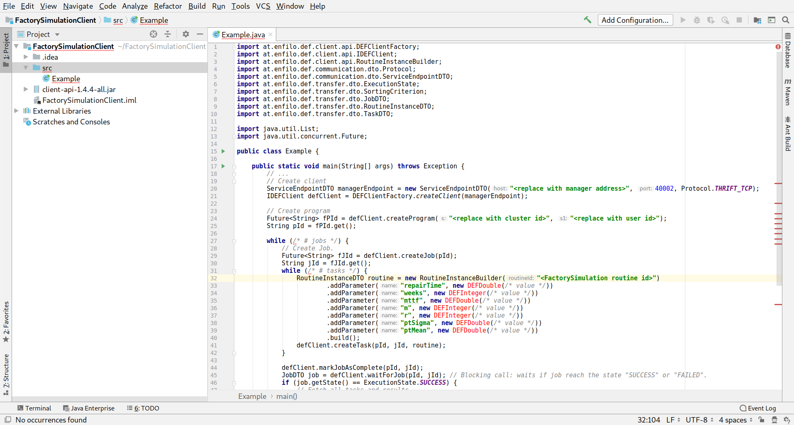

.. include:: ../../../isonum.txt
.. role::  raw-html(raw)
    :format: html

.. _clients-java:

========================
Java Client Development
========================

.. role:: java(code)
   :language: java

General
========

Creating clients in Java is quite simple: Create a new Java project, add the Client-API to it, copy the example code
from the Web-Manager and adapt it to your needs.

Steps to create a client
=========================

#. Create an empty Java project with the Client-API
#. Copy the example client code from the Web-Manager into the project
#. Generate and download all necessary DataTypes
#. Update the DEF connection data
#. Update Job and Task loops
#. Adapt input parameter values
#. Fetch and analyse the results

For the following steps, a client for the **FactorySimulation** that is described in :ref:`tutorial_factory` is written.

.. _clients-java_step1:

Client Step 1: Create an empty Java project with the Client-API
----------------------------------------------------------------

As a first step an empty Java project with the name **FactorySimulationClient** needs to be created with your favourite IDE
(`IntelliJ IDEA <https://www.jetbrains.com/idea/?fromMenu>`_ is used in the following steps). To create a DEF client in Java
the Client-API must be added to the newly created project:

#. Download the Client-API from the *Resources* section in the *Web-Manager* (Filename: ``client-api-<version>-all.jar``.
#. Place the downloaded file in the root folder of the project.
#. In IntelliJ IDEA rightclick the project and select *Open Module Settings* (F4).
#. Switch to *Libraries* and add ``client-api-<version>-all.jar`` as it can be seen in the image below.

.. _clients-java_step2:

Client Step 2: Copy the example client code from the Web-Manager into the project
----------------------------------------------------------------------------------

For every supported language and ref:`objective-routine` combination the *Web-Manager* provides an example client code.

Navigate to the details view of the desired :ref:`objective-routine`: *Library* :raw-html:`&rarr;` *Routines* :raw-html:`&rarr;` **FactorySimulation**

In the *Usage* section select ``Java`` as language and copy the displayed code to the clipboard.

Create a new Java class ``Example.java`` in the ``src`` directory of the project and paste the code from the clipboard
into this newly created class.

.. _clients-java_step3:

Client Step 3: Generate and download all necessary DataTypes
-------------------------------------------------------------

You will notice that all in and out parameter classes can not be found in ``Example.java`` as they still need to be added
to the project. The *Web-Manager* provides all necessary :ref:`DataTypes <data-types-detail>` for a language - :ref:`objective-routine`
combination.

Navigate again to the details view of the desired :ref:`objective-routine`: *Library* :raw-html:`&rarr;` *Routines* :raw-html:`&rarr;` **FactorySimulation**

In the *Usage* section select ``Java`` as language and click the *Generate Data types & download* above.

Decompress the downloaded zip file ``Java_dataTypes.zip`` and copy all the included ``*.java`` files in to the ``src``
directory of the project.

With that, all the missing references should be fixed.

.. _clients-java_step4:

Client Step 4: Update the DEF connection data
----------------------------------------------

Now the example code can be adapted which contains a few parts that should be completed or updated. One part is the connection data:

.. code-block:: java
    :linenos:
    :lineno-start: 19

    // Create client
    ServiceEndpointDTO managerEndpoint = new ServiceEndpointDTO("<replace with manager address>", 40002, Protocol.THRIFT_TCP);
    IDEFClient defClient = DEFClientFactory.createClient(managerEndpoint);

    // Create program
    Future<String> fPId = defClient.createProgram("<replace with cluster id>", "<replace with user id>");
    String pId = fPId.get();

Replace the marked fields with the appropriate connection data, f.e. the one of the :ref:`fhv-env`:

.. code-block:: java
    :linenos:
    :lineno-start: 19

    // Create client
    ServiceEndpointDTO managerEndpoint = new ServiceEndpointDTO("10.0.50.53", 40002, Protocol.THRIFT_TCP);
    IDEFClient defClient = DEFClientFactory.createClient(managerEndpoint);

    // Create program
    Future<String> fPId = defClient.createProgram("cluster1", "workshop");
    String pId = fPId.get();

.. _clients-java_step5:

Client Step 5: Update Job and Task loops
-----------------------------------------

The next thing is to complete the :ref:`job` and :ref:`task` loops. You can either add abort criteria to the `while`
loops or replace them with `for` loops. You can as well extend the code as you like. The example code of the **FactorySimulation**
with ``for`` loops looks like the following.

.. code-block:: java
    :linenos:
    :lineno-start: 27

    for (int j = 0; j < 1; j++) { // create only one job
        // Create Job.
        Future<String> fJId = defClient.createJob(pId);
        String jId = fJId.get();
        for (int t = 0; t < 1; t++) { // create only one task
            RoutineInstanceDTO routine = new RoutineInstanceBuilder("<FactorySimulation routine id>")
                    .addParameter("repairTime", new DEFDouble(/* value */))
                    .addParameter("weeks", new DEFInteger(/* value */))
                    .addParameter("mttf", new DEFDouble(/* value */))
                    .addParameter("m", new DEFInteger(/* value */))
                    .addParameter("r", new DEFInteger(/* value */))
                    .addParameter("ptSigma", new DEFDouble(/* value */))
                    .addParameter("ptMean", new DEFDouble(/* value */))
                    .build();
            defClient.createTask(pId, jId, routine);
        }
        // ..

Client Step 6: Adapt input parameter values
--------------------------------------------

Now the input parameters for the routine have to be filled with actual data, for example:

.. code-block:: java
    :linenos:
    :lineno-start: 27

    for (int j = 0; j < 1; j++) { // create only one job
        // Create Job.
        Future<String> fJId = defClient.createJob(pId);
        String jId = fJId.get();
        for (int t = 0; t < 1; t++) { // create only one task
            RoutineInstanceDTO routine = new RoutineInstanceBuilder("<FactorySimulation routine id>")
                    .addParameter("repairTime", new DEFDouble(240.0))
                    .addParameter("weeks", new DEFInteger(52))
                    .addParameter("mttf", new DEFDouble(10080.0))
                    .addParameter("m", new DEFInteger(10))
                    .addParameter("r", new DEFInteger(2))
                    .addParameter("ptSigma", new DEFDouble(60.0))
                    .addParameter("ptMean", new DEFDouble(0.1))
                    .build();
            defClient.createTask(pId, jId, routine);
        }
        // ..

.. _clients-java_step7:

Client Step 7: Fetch and analyse the results
-----------------------------------------------

The last thing is to fetch all the results and analyse them. The easiest way to do that is to print the routine results
to the ``stdout``.

.. code-block:: java
    :linenos:
    :lineno-start: 47

    // Fetch all tasks and results.
    List<String> tIds = defClient.getAllTasksWithState(pId, jId, ExecutionState.SUCCESS, SortingCriterion.NO_SORTING).get();
    for (String tId : tIds) {
        TaskDTO task = defClient.getTask(pId, jId, tId).get();
        FactorySimulationResult result = defClient.extractOutParameter(task, FactorySimulationResult.class);
        // Process task result.
        System.out.println(result);
    }

However, you can adapt this code completely to your desires and needs. You can use the results of one :ref:`job` to construct
the input parameters for another job. You can also move this code part from the end of the
:ref:`job` loop to the place after the loop.

Finally, after applying all these changes the ``Example.java`` class looks like this and should be runnable (no errors,
no missing references, etc.):

.. literalinclude:: Example.java
    :linenos:
    :language: java

.. _clients-java_two-parts:

Two-part client
================

It is also possible to separate the client into two parts, the first one being responsible for creating :ref:`Jobs <job>`
and :ref:`Tasks <task>`, and the second one being responsible for fetching and evaluating the results.

.. literalinclude:: ExamplePart1.java
    :linenos:
    :language: java

.. literalinclude:: ExamplePart2.java
    :linenos:
    :language: java

Clients for Programs with ReduceRoutines
=========================================

For using a ReduceRoutine it is necessary to make two adaptions to the client code. One when creating the jobs and one
when fetching the results. For showing the adaptions the two-part client is used.

In the first client code part for creating jobs and tasks the following line has to be added after creating a job.

.. code-block:: java
    :linenos:
    :lineno-start: 31

            // Create Job.
            Future<String> fJId = defClient.createJob(pId);
            String jId = fJId.get();
            System.out.printf("jId: %s\n", jId);

            // Attach reduce routine
            defClient.attachReduceRoutine(pId, jId, "<id of reduce routine>");

In the second client code part it isn't necessary anymore to fetch all tasks with their results. The job now holds the
reduced value which might be enough for further calculations or considerations. This means that the following code

.. code-block:: java
    :linenos:
    :lineno-start: 28

        JobDTO job = defClient.waitForJob(pId, jId); // Blocking call: waits if job reach the state "SUCCESS" or "FAILED".
        if (job.getState() == ExecutionState.SUCCESS) {
            // Fetch all tasks and results.
            List<String> tIds = defClient.getAllTasksWithState(pId, jId, ExecutionState.SUCCESS, SortingCriterion.NO_SORTING).get();
            for (String tId : tIds) {
                TaskDTO task = defClient.getTask(pId, jId, tId).get();
                FactorySimulationResult result = defClient.extractOutParameter(task, FactorySimulationResult.class);
                // Process task result.
                System.out.println(result);
            }
        }

can be replaced by this:

.. code-block:: java
    :linenos:
    :lineno-start: 28

        JobDTO job = defClient.waitForJob(pId, jId); // Blocking call: waits if job reach the state "SUCCESS" or "FAILED".
        if (job.getState() == ExecutionState.SUCCESS) {
            // Fetch reduce result
            FactorySimulationResult reducedResult = defClient.extractReducedResult(job, FactorySimulationResult.class);
            System.out.println(reducedResult);
        }

Which leads to the whole client code looking like this:

Which leads to the whole client code looking like this.

.. literalinclude:: ExampleReducePart1.java
    :linenos:
    :language: java

.. literalinclude:: ExampleReducePart2.java
    :linenos:
    :language: java