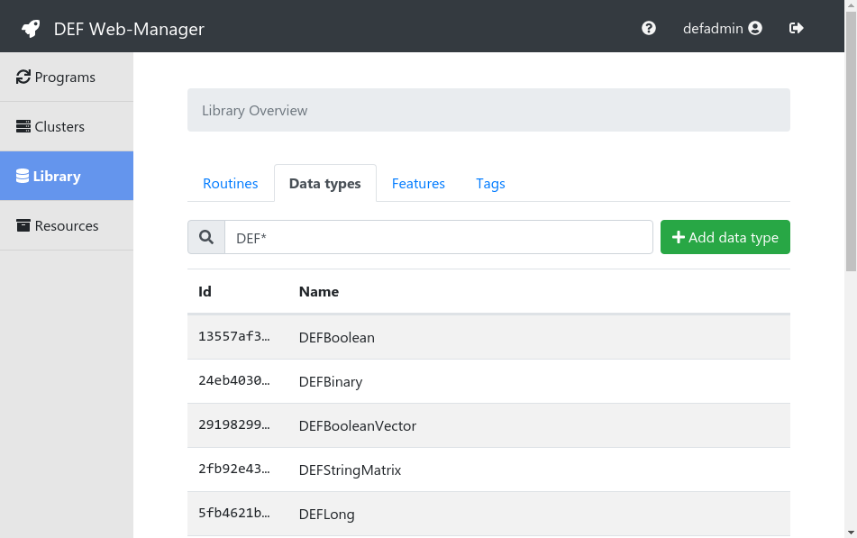
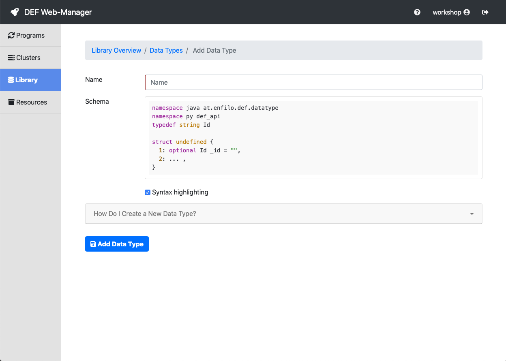
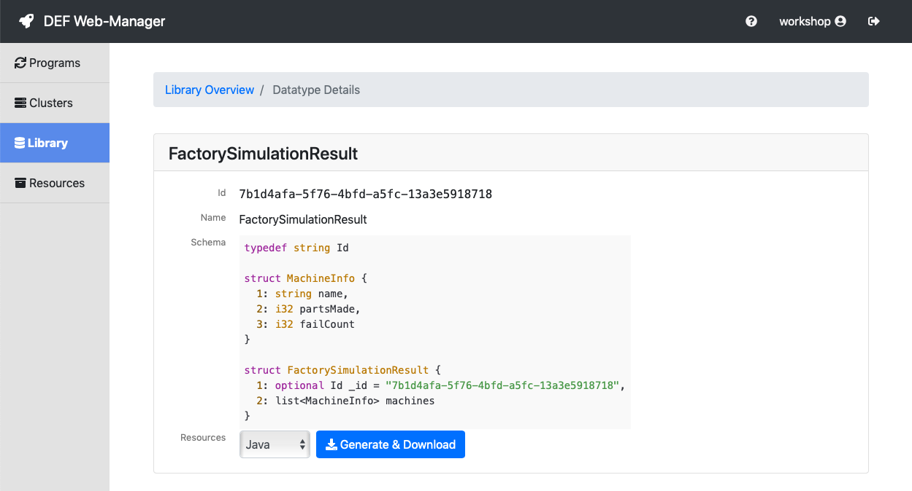

.. _data-type-dev:

====================
DataType Development
====================

For understanding the concept and the idea behind data types see :ref:`data-types-detail`.

DEF data types are written in the Thrift interface definition language (IDL) and compiled afterwards with
the Thrift compiler. The DEF offers a number of basic data types which are already defined and can be used.
An example for a basic data type is the DEFInteger type which is just a wrapper for a 32-bit integer value.
The definition in the Thrift IDL is listed below.

.. code-block:: thrift

    namespace java at.enfilo.def.datatype
    namespace py def_api
    typedef string Id

    struct DEFInteger {
        1: optional Id _id = "6389a2fb-eace-310b-b178-9c4d7b1daaa0",
        2: i32 value
    }

All the available data types of a DEF instance can be found in the :ref:`web-manager` in the *Library* section.

The DEF supports the creation of custom data types for individual input and output data of routines.
By clicking on the **Add data type** button in the *Data types* tab in the *Library* section a form is opened
where new data types can be created.

First of all a name has to be defined. Afterwards the data type itself can be defined in the *Schema* text area.
To keep it as simple as possible, a default definition is already given that only needs to be adapted.
By clicking on the *How Do I Create A New Data Type?* section an accordion opens up with some helpful information
on how to define a data type in the Thrift IDL.

The name that is given in the *Name* text field is automatically set as struct name in the schema.
It is only necessary to define the contents of the struct. The first entry always needs to be the ``optional Id _id = ""``,
so don't delete that! If we want to create a data type that contains f.e. a list with int values and a string the definition
looks like the following.

.. code-block:: thrift

    namespace java.at.enfilo.def.datatype
    namespace py def_api
    typedef string Id

    struct CustomDataType {
      1: optional Id _id = "",
      2: list<i32> values,
      3: string text

    }

It is also possible to create nested data types like in the :ref:`tutorial_factory`.

.. code-block:: thrift

    typedef string Id

    struct MachineInfo {
      1: string name,
      2: i32 partsMade,
      3: i32 failCount
    }

    struct FactorySimulationResult {
      1: optional Id _id = "",
      2: list<MachineInfo> machines
    }

By clicking on the *Add Data Type* button the defined data type will be saved.
Afterwards it is as well listed in the *Data types* tab in the *Library* section.
To see its details it can be selected in the list.

To use this custom data type for client or routine development, it needs to be downloaded in the appropriate
programming language. To do that, the corresponding language can be selected in the drop down menu below the
data type definition. The files in the defined programming language are generated and downloaded after clicking
on *Generate & Download*. Afterwards the downloaded files just need to be included into the project and can be used.